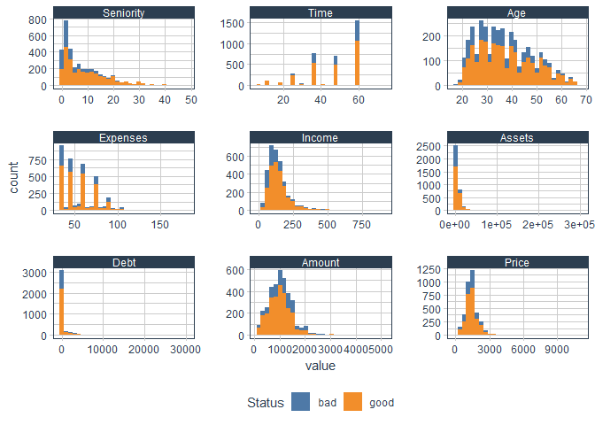
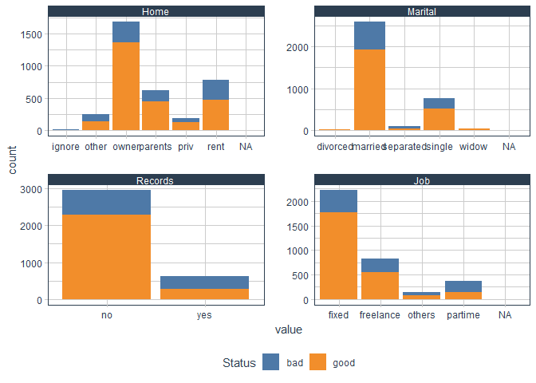
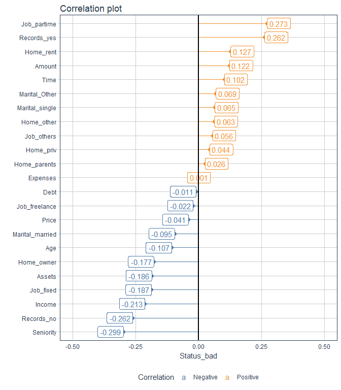
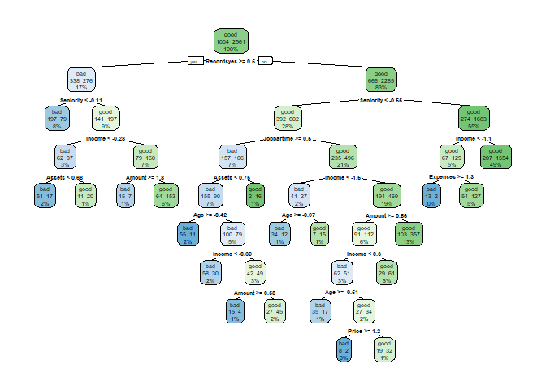
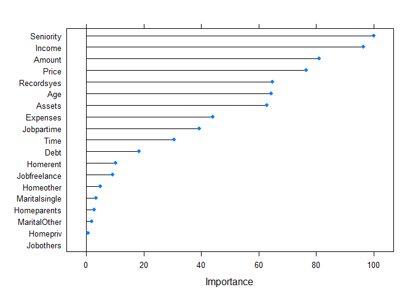
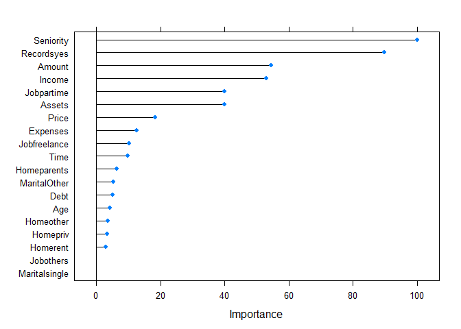
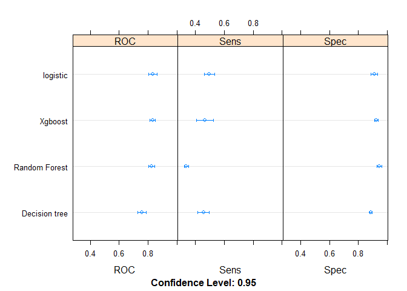
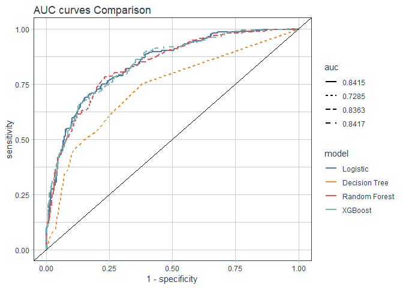

Credit Risk Modeling
================

### Import Libraries

``` r
library(tidyverse)
library(rsample)
library(recipes)
library(funModeling)
library(tidyquant)
library(ggthemes)
```

\#\#\# Data

``` r
# load credit data from recipes library

data("credit_data")

credit_df <- credit_data

# proportion of good and bad loans

credit_df$Status %>% table() %>% prop.table()
```

    ## .
    ##       bad      good 
    ## 0.2815447 0.7184553

### Split credit\_df into train and test

``` r
set.seed(345)

split_obj <- initial_split(credit_df, prop = 0.8, strata = 'Status')

train_tbl <- training(split_obj)

test_tbl  <- testing(split_obj)


glimpse(train_tbl)
```

    ## Observations: 3,565
    ## Variables: 14
    ## $ Status    <fct> good, good, bad, good, good, good, good, good, bad, ...
    ## $ Seniority <int> 9, 17, 10, 0, 0, 1, 29, 0, 0, 6, 8, 19, 0, 33, 0, 1,...
    ## $ Home      <fct> rent, rent, owner, rent, rent, owner, owner, owner, ...
    ## $ Time      <int> 60, 60, 36, 60, 36, 60, 60, 60, 48, 48, 60, 36, 24, ...
    ## $ Age       <int> 30, 58, 46, 24, 26, 36, 44, 32, 41, 34, 30, 37, 68, ...
    ## $ Marital   <fct> married, widow, married, single, single, married, ma...
    ## $ Records   <fct> no, no, yes, no, no, no, no, no, no, no, no, no, no,...
    ## $ Job       <fct> freelance, fixed, freelance, fixed, fixed, fixed, fi...
    ## $ Expenses  <int> 73, 48, 90, 63, 46, 75, 75, 90, 90, 60, 75, 75, 75, ...
    ## $ Income    <int> 129, 131, 200, 182, 107, 214, 125, 107, 80, 125, 199...
    ## $ Assets    <int> 0, 0, 3000, 2500, 0, 3500, 10000, 15000, 0, 4000, 50...
    ## $ Debt      <int> 0, 0, 0, 0, 0, 0, 0, 0, 0, 0, 2500, 260, 0, 2000, 0,...
    ## $ Amount    <int> 800, 1000, 2000, 900, 310, 650, 1600, 1200, 1200, 11...
    ## $ Price     <int> 846, 1658, 2985, 1325, 910, 1645, 1800, 1957, 1468, ...

### Exploratory Data Analysis

``` r
# Quick look at the data 

df_status(train_tbl)
```

    ##     variable q_zeros p_zeros q_na p_na q_inf p_inf    type unique
    ## 1     Status       0    0.00    0 0.00     0     0  factor      2
    ## 2  Seniority     430   12.06    0 0.00     0     0 integer     45
    ## 3       Home       0    0.00    5 0.14     0     0  factor      6
    ## 4       Time       0    0.00    0 0.00     0     0 integer     11
    ## 5        Age       0    0.00    0 0.00     0     0 integer     50
    ## 6    Marital       0    0.00    1 0.03     0     0  factor      5
    ## 7    Records       0    0.00    0 0.00     0     0  factor      2
    ## 8        Job       0    0.00    2 0.06     0     0  factor      4
    ## 9   Expenses       0    0.00    0 0.00     0     0 integer     91
    ## 10    Income       0    0.00  303 8.50     0     0 integer    332
    ## 11    Assets    1303   36.55   43 1.21     0     0 integer    142
    ## 12      Debt    2925   82.05   17 0.48     0     0 integer    160
    ## 13    Amount       0    0.00    0 0.00     0     0 integer    251
    ## 14     Price       0    0.00    0 0.00     0     0 integer   1289

``` r
# further look at the data

Hmisc::describe(train_tbl)
```

    ## train_tbl 
    ## 
    ##  14  Variables      3565  Observations
    ## ---------------------------------------------------------------------------
    ## Status 
    ##        n  missing distinct 
    ##     3565        0        2 
    ##                       
    ## Value        bad  good
    ## Frequency   1004  2561
    ## Proportion 0.282 0.718
    ## ---------------------------------------------------------------------------
    ## Seniority 
    ##        n  missing distinct     Info     Mean      Gmd      .05      .10 
    ##     3565        0       45    0.995    8.047    8.606        0        0 
    ##      .25      .50      .75      .90      .95 
    ##        2        5       12       20       25 
    ## 
    ## lowest :  0  1  2  3  4, highest: 42 43 45 47 48
    ## ---------------------------------------------------------------------------
    ## Home 
    ##        n  missing distinct 
    ##     3560        5        6 
    ##                                                           
    ## Value       ignore   other   owner parents    priv    rent
    ## Frequency       15     250    1688     627     196     784
    ## Proportion   0.004   0.070   0.474   0.176   0.055   0.220
    ## ---------------------------------------------------------------------------
    ## Time 
    ##        n  missing distinct     Info     Mean      Gmd      .05      .10 
    ##     3565        0       11    0.903    46.31    15.78       18       24 
    ##      .25      .50      .75      .90      .95 
    ##       36       48       60       60       60 
    ##                                                                       
    ## Value          6    12    18    24    30    36    42    48    54    60
    ## Frequency     30   118    76   281    40   757    23   698    12  1529
    ## Proportion 0.008 0.033 0.021 0.079 0.011 0.212 0.006 0.196 0.003 0.429
    ##                 
    ## Value         72
    ## Frequency      1
    ## Proportion 0.000
    ## ---------------------------------------------------------------------------
    ## Age 
    ##        n  missing distinct     Info     Mean      Gmd      .05      .10 
    ##     3565        0       50    0.999    37.13    12.49       22       24 
    ##      .25      .50      .75      .90      .95 
    ##       28       36       45       53       57 
    ## 
    ## lowest : 18 19 20 21 22, highest: 63 64 65 66 68
    ## ---------------------------------------------------------------------------
    ## Marital 
    ##        n  missing distinct 
    ##     3564        1        5 
    ##                                                             
    ## Value       divorced   married separated    single     widow
    ## Frequency         36      2596       106       771        55
    ## Proportion     0.010     0.728     0.030     0.216     0.015
    ## ---------------------------------------------------------------------------
    ## Records 
    ##        n  missing distinct 
    ##     3565        0        2 
    ##                       
    ## Value         no   yes
    ## Frequency   2951   614
    ## Proportion 0.828 0.172
    ## ---------------------------------------------------------------------------
    ## Job 
    ##        n  missing distinct 
    ##     3563        2        4 
    ##                                                   
    ## Value          fixed freelance    others   partime
    ## Frequency       2223       823       144       373
    ## Proportion     0.624     0.231     0.040     0.105
    ## ---------------------------------------------------------------------------
    ## Expenses 
    ##        n  missing distinct     Info     Mean      Gmd      .05      .10 
    ##     3565        0       91    0.967    55.76     21.2       35       35 
    ##      .25      .50      .75      .90      .95 
    ##       35       51       73       82       90 
    ## 
    ## lowest :  35  37  38  39  40, highest: 153 165 168 173 180
    ## ---------------------------------------------------------------------------
    ## Income 
    ##        n  missing distinct     Info     Mean      Gmd      .05      .10 
    ##     3262      303      332        1    141.7    79.35    55.05    67.00 
    ##      .25      .50      .75      .90      .95 
    ##    90.00   125.00   170.00   232.90   290.95 
    ## 
    ## lowest :   6   8  16  19  20, highest: 700 715 800 830 905
    ## ---------------------------------------------------------------------------
    ## Assets 
    ##        n  missing distinct     Info     Mean      Gmd      .05      .10 
    ##     3522       43      142    0.948     5458     7379        0        0 
    ##      .25      .50      .75      .90      .95 
    ##        0     3000     6000    12000    18975 
    ## 
    ## lowest :      0     18    300    450    500, highest: 110000 150000 200000 250000 300000
    ## ---------------------------------------------------------------------------
    ## Debt 
    ##        n  missing distinct     Info     Mean      Gmd      .05      .10 
    ##     3548       17      160     0.44    348.6    635.1        0        0 
    ##      .25      .50      .75      .90      .95 
    ##        0        0        0     1200     2500 
    ## 
    ## lowest :     0     1    10    12    25, highest: 15500 20000 21400 23500 30000
    ## ---------------------------------------------------------------------------
    ## Amount 
    ##        n  missing distinct     Info     Mean      Gmd      .05      .10 
    ##     3565        0      251    0.997     1036    512.3      350      450 
    ##      .25      .50      .75      .90      .95 
    ##      700     1000     1300     1600     1800 
    ## 
    ## lowest :  100  107  120  125  150, highest: 3800 3875 3900 4000 5000
    ## ---------------------------------------------------------------------------
    ## Price 
    ##        n  missing distinct     Info     Mean      Gmd      .05      .10 
    ##     3565        0     1289        1     1457    617.3    600.0    818.4 
    ##      .25      .50      .75      .90      .95 
    ##   1104.0   1398.0   1688.0   2143.0   2414.0 
    ## 
    ## lowest :   125   175   200   240   270, highest:  6500  6700  6900  8800 11140
    ## ---------------------------------------------------------------------------

``` r
# Visualize numerical features with histogram

num_features <- train_tbl %>% select_if(is.numeric) %>% names()


train_tbl %>% 
  select(Status,one_of(num_features)) %>% 
  gather(key, value, -Status, factor_key = T) %>% 
  ggplot(aes(x = value, fill = Status))+
  geom_histogram()+
  facet_wrap(~ key, scales = 'free')+
  theme_tq()+
  scale_fill_tableau()
```



Some features are skewed so we need to transform them. checking the skweness of the features and distribution

``` r
profiling_num(train_tbl)
```

    ##    variable mean std_dev variation_coef p_01 p_05 p_25 p_50 p_75  p_95
    ## 1 Seniority    8     8.2           1.02    0    0    2    5   12    25
    ## 2      Time   46    14.7           0.32   12   18   36   48   60    60
    ## 3       Age   37    11.0           0.30   20   22   28   36   45    57
    ## 4  Expenses   56    19.6           0.35   35   35   35   51   73    90
    ## 5    Income  142    80.7           0.57   35   55   90  125  170   291
    ## 6    Assets 5458 11899.2           2.18    0    0    0 3000 6000 18975
    ## 7      Debt  349  1280.1           3.67    0    0    0    0    0  2500
    ## 8    Amount 1036   476.0           0.46  200  350  700 1000 1300  1800
    ## 9     Price 1457   631.2           0.43  375  600 1104 1398 1688  2414
    ##    p_99 skewness kurtosis  iqr       range_98      range_80
    ## 1    35     1.37      4.8   10        [0, 35]       [0, 20]
    ## 2    60    -0.76      2.6   24       [12, 60]      [24, 60]
    ## 3    63     0.47      2.4   17       [20, 63]      [24, 53]
    ## 4   106     1.04      4.6   38   [35, 105.72]      [35, 82]
    ## 5   450     2.44     14.2   80      [35, 450]   [67, 232.9]
    ## 6 50000    10.79    197.6 6000     [0, 50000]    [0, 12000]
    ## 7  4632     9.90    164.8    0    [0, 4632.5]     [0, 1200]
    ## 8  2500     1.17      7.6  600    [200, 2500]   [450, 1600]
    ## 9  3590     3.06     31.1  584 [375, 3589.52] [818.4, 2143]

It seems that except for Age and Time all the numerical features are skewed to right so we will transform them.

``` r
skewed_feat <- setdiff(num_features, c('Time','Age'))
```

Distribution of categorical features

``` r
train_tbl %>% 
  mutate_if(is.factor, ~ fct_explicit_na(.)) %>% 
  categ_analysis(target = 'Status')
```

    ##        Home mean_target sum_target perc_target q_rows perc_rows
    ## 1 (Missing)        0.80          4       0.004      5     0.001
    ## 2    ignore        0.47          7       0.007     15     0.004
    ## 3     other        0.44        111       0.111    250     0.070
    ## 4      rent        0.40        310       0.309    784     0.220
    ## 5      priv        0.34         67       0.067    196     0.055
    ## 6   parents        0.29        183       0.182    627     0.176
    ## 7     owner        0.19        322       0.321   1688     0.473
    ## 
    ##     Marital mean_target sum_target perc_target q_rows perc_rows
    ## 1 separated        0.50         53       0.053    106     0.030
    ## 2  divorced        0.36         13       0.013     36     0.010
    ## 3    single        0.34        258       0.257    771     0.216
    ## 4     widow        0.29         16       0.016     55     0.015
    ## 5   married        0.26        664       0.661   2596     0.728
    ## 6 (Missing)        0.00          0       0.000      1     0.000
    ## 
    ##   Records mean_target sum_target perc_target q_rows perc_rows
    ## 1     yes        0.55        338        0.34    614      0.17
    ## 2      no        0.23        666        0.66   2951      0.83
    ## 
    ##         Job mean_target sum_target perc_target q_rows perc_rows
    ## 1 (Missing)        1.00          2       0.002      2     0.001
    ## 2   partime        0.60        223       0.222    373     0.105
    ## 3    others        0.40         57       0.057    144     0.040
    ## 4 freelance        0.32        266       0.265    823     0.231
    ## 5     fixed        0.20        456       0.454   2223     0.624

    ## [1] "Variables processed: Home, Marital, Records, Job"

Lets also visualize the distribution of categorical features with bar plots.

``` r
train_tbl %>% 
  select_if(is.factor) %>% 
  gather(key, value, -Status,factor_key = T) %>% 
  ggplot(aes(x = value, fill = Status))+
  geom_bar()+
  facet_wrap(~ key, scales = 'free')+
  theme_tq()+
  scale_fill_tableau()
```

 It seems that threr is cardinality issues in the categorical features Home and Marital, so we will combine the less observed classes (less that 10%) to 'other' category

``` r
train_tbl <- train_tbl %>% 
  mutate(Home    =  fct_other(Home,drop='ignore',other_level = 'other'),
         Marital =  fct_other(Marital, keep = c('married','single')))

test_tbl <- test_tbl %>% 
  mutate(Home    =  fct_other(Home,drop='ignore', other_level = 'other'),
         Marital =  fct_other(Marital, keep = c('married','single'))) 
```

``` r
train_tbl %>% 
  select(Home, Marital) %>% 
  map(~ prop.table(table(.)))
```

    ## $Home
    ## .
    ##   owner parents    priv    rent   other 
    ##   0.474   0.176   0.055   0.220   0.074 
    ## 
    ## $Marital
    ## .
    ## married  single   Other 
    ##   0.728   0.216   0.055

Check correlation of input features to target feature

``` r
cor_recipe <- recipe(Status ~ ., data = train_tbl %>% drop_na) %>% 
  step_YeoJohnson(skewed_feat) %>% 
  step_dummy(all_nominal(), one_hot = T) %>% 
  prep()
```

visualize correlation

``` r
cor_recipe %>% 
  bake(train_tbl %>% drop_na) %>% 
  cor(y = .$Status_bad) %>% 
  as_tibble(rownames = 'Features') %>% 
  rename(Status_bad = V1) %>% 
  filter( ! Features %in% c('Status_good','Status_bad')) %>% 
  mutate(Correlation = ifelse(Status_bad >0,'Positive','Negative')) %>% 
  ggplot(aes(x = Status_bad, y = fct_reorder(Features,Status_bad), color = Correlation))+
  geom_point(size=2)+
  geom_segment(aes(xend = 0, yend = Features))+
  geom_label(aes(label = round(Status_bad,3), color = Correlation), hjust='outward')+
  geom_vline(xintercept = 0, size = 1)+
  expand_limits(x = c(-0.5,0.5))+
  labs(title = 'Correlation plot', y = '')+
  theme_tq()+
  scale_color_tableau()
```



Modeling

``` r
# modeling recipe

model_recipe <- recipe(Status ~ ., data = train_tbl) %>% 
  step_knnimpute(all_predictors()) %>% 
  step_YeoJohnson(skewed_feat) %>% 
  step_center(all_numeric()) %>% 
  step_scale(all_numeric()) %>% 
  prep()
```

``` r
# bake train and test tbl

train_tbl <-  bake(model_recipe, train_tbl) 

test_tbl  <-  bake(model_recipe, test_tbl)
```

``` r
library(caret)


# set the train controls

train_ctrl <- trainControl(method = 'repeatedcv', number = 5,
                           classProbs = TRUE,
                           summaryFunction = twoClassSummary)
```

Logistic Regression

``` r
logi_model <- train(Status ~ ., data = train_tbl,
                    method = 'glm', family = 'binomial',
                    trControl = train_ctrl,
                    metric = 'ROC')
```

Decision Tree

``` r
tree_model <- train(Status ~ ., data = train_tbl,
                    method = 'rpart', 
                    tuneLength = 10,
                    trControl = train_ctrl,
                    metric = 'ROC')
```

``` r
library(rpart.plot)

rpart.plot(tree_model$finalModel,extra = 101, fallen.leaves = F)
```



Random Forest

``` r
rf_model <- train(Status ~ ., data = train_tbl,
                    method = 'rf', 
                    tuneLength = 5,
                    trControl = train_ctrl,
                    metric = 'ROC')
```

``` r
varImp(rf_model) %>% plot()
```



Xgboost

``` r
xgb_model <- train(Status ~ ., data = train_tbl,
                    method = 'xgbTree', 
                    tuneLength = 3,
                    trControl = train_ctrl,
                    metric = 'ROC')
```

``` r
varImp(xgb_model) %>% plot()
```



Model Comparisons

``` r
models <- resamples(list('logistic' = logi_model,
                         'Decision tree' =tree_model,
                         'Random Forest' = rf_model,
                         'Xgboost' = xgb_model))

dotplot(models)
```



Model Evaluation

``` r
# prediction on test set

pred_logi <- predict(logi_model, test_tbl, type = 'prob')

pred_tree <- predict(tree_model, test_tbl, type = 'prob')

pred_rf   <- predict(rf_model, test_tbl, type = 'prob')

pred_xgb  <- predict(xgb_model,test_tbl, type = 'prob')
```

AUC curves

``` r
library(yardstick)

eval_tbl <- tibble(true_class = test_tbl$Status,
                   logi_bad   = pred_logi$bad,
                   tree_bad   = pred_tree$bad,
                   rf_bad     = pred_rf$bad,
                   xgb_bad    = pred_xgb$bad)
```

``` r
auc_logi_tbl <- eval_tbl%>% roc_curve(true_class,logi_bad) %>% 
  mutate(model = 'Logistic',
         auc = roc_auc_vec(eval_tbl$true_class, eval_tbl$logi_bad))

auc_tree_tbl <- eval_tbl %>% roc_curve(true_class, tree_bad) %>% 
   mutate(model = 'Decision Tree',
         auc = roc_auc_vec(eval_tbl$true_class, eval_tbl$tree_bad))

auc_rf_tbl <- eval_tbl %>% roc_curve(true_class, rf_bad) %>% 
   mutate(model = 'Random Forest',
         auc = roc_auc_vec(eval_tbl$true_class, eval_tbl$rf_bad))

auc_xgb_tbl <- eval_tbl %>% roc_curve(true_class, xgb_bad) %>% 
   mutate(model = 'XGBoost',
         auc = roc_auc_vec(eval_tbl$true_class, eval_tbl$xgb_bad))


# combine the auc tbls

auc_combine_tbl <- bind_rows(auc_logi_tbl,auc_tree_tbl,auc_rf_tbl,auc_xgb_tbl)
```

Plot the AUC curves

``` r
auc_combine_tbl %>% 
  mutate_if(is.character,as_factor) %>% 
  mutate(auc = round(auc,4) %>% as.character() %>% as_factor()) %>% 
  ggplot(aes(x = 1 - specificity, y = sensitivity, group = model))+
  geom_line(aes(color = model, linetype = auc),size = 1)+
  geom_abline()+
  labs(title = 'AUC curves Comparison')+
  theme_tq()+
  scale_color_tableau()+
  theme(legend.position = 'right')
```



Confusion Matrix for Xgb model

``` r
pred_test <- predict(xgb_model,test_tbl)


# confusionmatrix at 0.5 threshold

confusionMatrix(pred_test, test_tbl$Status)
```

    ## Confusion Matrix and Statistics
    ## 
    ##           Reference
    ## Prediction bad good
    ##       bad  121   46
    ##       good 129  593
    ##                                         
    ##                Accuracy : 0.803         
    ##                  95% CI : (0.775, 0.829)
    ##     No Information Rate : 0.719         
    ##     P-Value [Acc > NIR] : 4.37e-09      
    ##                                         
    ##                   Kappa : 0.458         
    ##  Mcnemar's Test P-Value : 5.70e-10      
    ##                                         
    ##             Sensitivity : 0.484         
    ##             Specificity : 0.928         
    ##          Pos Pred Value : 0.725         
    ##          Neg Pred Value : 0.821         
    ##              Prevalence : 0.281         
    ##          Detection Rate : 0.136         
    ##    Detection Prevalence : 0.188         
    ##       Balanced Accuracy : 0.706         
    ##                                         
    ##        'Positive' Class : bad           
    ##
