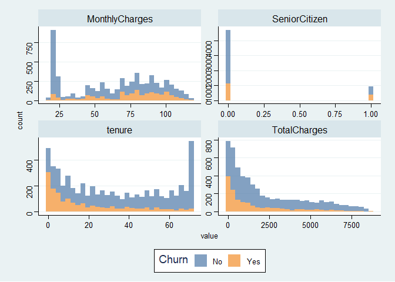
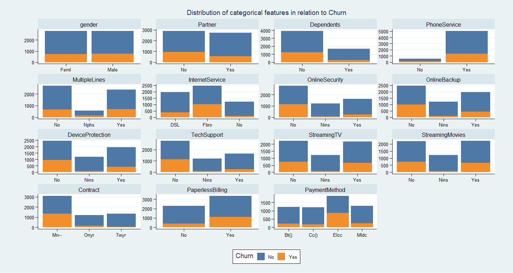
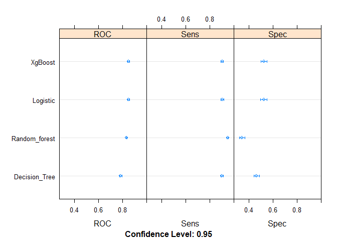
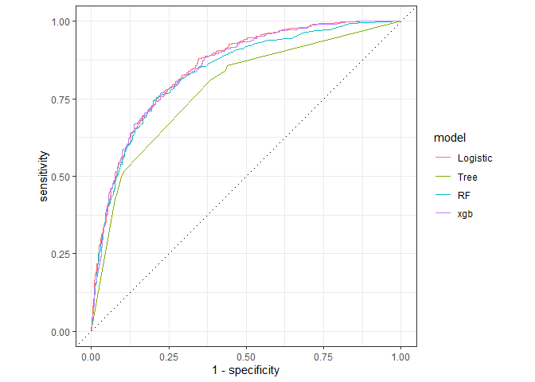
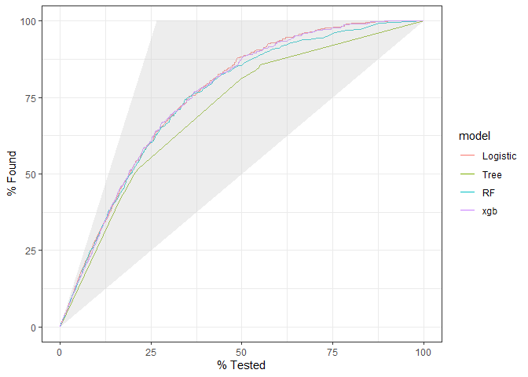
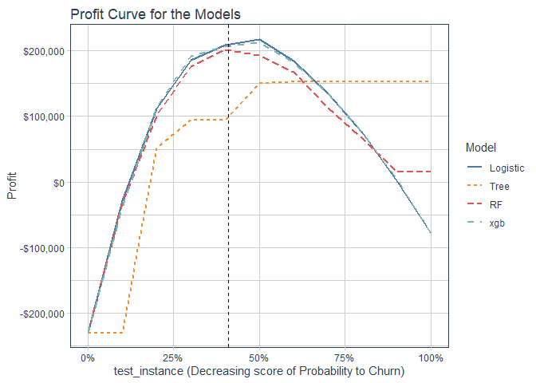

Telecom Churn Prediction
================

  - [1. Import Libraries](#import-libraries)
  - [2. Load Data](#load-data)
  - [3. EDA](#eda)
  - [4. Modeling](#modeling)
  - [5. Evaluation on test data](#evaluation-on-test-data)
  - [6. Profit curve](#profit-curve)

### 1\. Import Libraries

``` r
library(tidyverse)
library(readxl)
library(caret)
library(yardstick)
library(lime)
library(funModeling)
library(rsample)
library(recipes)
library(purrr)
library(ggthemes)
library(tidyquant)
```

### 2\. Load Data

``` r
churn_data_raw <- read_excel('WA_Fn-UseC_-Telco-Customer-Churn.xlsx')

churn_data_raw %>% glimpse()
```

    ## Observations: 7,043
    ## Variables: 21
    ## $ customerID       <chr> "7590-VHVEG", "5575-GNVDE", "3668-QPYBK", "7795-CF...
    ## $ gender           <chr> "Female", "Male", "Male", "Male", "Female", "Femal...
    ## $ SeniorCitizen    <dbl> 0, 0, 0, 0, 0, 0, 0, 0, 0, 0, 0, 0, 0, 0, 0, 0, 0,...
    ## $ Partner          <chr> "Yes", "No", "No", "No", "No", "No", "No", "No", "...
    ## $ Dependents       <chr> "No", "No", "No", "No", "No", "No", "Yes", "No", "...
    ## $ tenure           <dbl> 1, 34, 2, 45, 2, 8, 22, 10, 28, 62, 13, 16, 58, 49...
    ## $ PhoneService     <chr> "No", "Yes", "Yes", "No", "Yes", "Yes", "Yes", "No...
    ## $ MultipleLines    <chr> "No phone service", "No", "No", "No phone service"...
    ## $ InternetService  <chr> "DSL", "DSL", "DSL", "DSL", "Fiber optic", "Fiber ...
    ## $ OnlineSecurity   <chr> "No", "Yes", "Yes", "Yes", "No", "No", "No", "Yes"...
    ## $ OnlineBackup     <chr> "Yes", "No", "Yes", "No", "No", "No", "Yes", "No",...
    ## $ DeviceProtection <chr> "No", "Yes", "No", "Yes", "No", "Yes", "No", "No",...
    ## $ TechSupport      <chr> "No", "No", "No", "Yes", "No", "No", "No", "No", "...
    ## $ StreamingTV      <chr> "No", "No", "No", "No", "No", "Yes", "Yes", "No", ...
    ## $ StreamingMovies  <chr> "No", "No", "No", "No", "No", "Yes", "No", "No", "...
    ## $ Contract         <chr> "Month-to-month", "One year", "Month-to-month", "O...
    ## $ PaperlessBilling <chr> "Yes", "No", "Yes", "No", "Yes", "Yes", "Yes", "No...
    ## $ PaymentMethod    <chr> "Electronic check", "Mailed check", "Mailed check"...
    ## $ MonthlyCharges   <dbl> 29.85, 56.95, 53.85, 42.30, 70.70, 99.65, 89.10, 2...
    ## $ TotalCharges     <dbl> 29.85, 1889.50, 108.15, 1840.75, 151.65, 820.50, 1...
    ## $ Churn            <chr> "No", "No", "Yes", "No", "Yes", "Yes", "No", "No",...

Distibution of churn

``` r
prop.table(table(churn_data_raw$Churn))
```

    ## 
    ##        No       Yes 
    ## 0.7346301 0.2653699

### 3\. EDA

Lets have a quick look at the data : check missing data

``` r
df_status(churn_data_raw)
```

    ##            variable q_zeros p_zeros q_na p_na q_inf p_inf      type unique
    ## 1        customerID       0    0.00    0 0.00     0     0 character   7043
    ## 2            gender       0    0.00    0 0.00     0     0 character      2
    ## 3     SeniorCitizen    5901   83.79    0 0.00     0     0   numeric      2
    ## 4           Partner       0    0.00    0 0.00     0     0 character      2
    ## 5        Dependents       0    0.00    0 0.00     0     0 character      2
    ## 6            tenure      11    0.16    0 0.00     0     0   numeric     73
    ## 7      PhoneService       0    0.00    0 0.00     0     0 character      2
    ## 8     MultipleLines       0    0.00    0 0.00     0     0 character      3
    ## 9   InternetService       0    0.00    0 0.00     0     0 character      3
    ## 10   OnlineSecurity       0    0.00    0 0.00     0     0 character      3
    ## 11     OnlineBackup       0    0.00    0 0.00     0     0 character      3
    ## 12 DeviceProtection       0    0.00    0 0.00     0     0 character      3
    ## 13      TechSupport       0    0.00    0 0.00     0     0 character      3
    ## 14      StreamingTV       0    0.00    0 0.00     0     0 character      3
    ## 15  StreamingMovies       0    0.00    0 0.00     0     0 character      3
    ## 16         Contract       0    0.00    0 0.00     0     0 character      3
    ## 17 PaperlessBilling       0    0.00    0 0.00     0     0 character      2
    ## 18    PaymentMethod       0    0.00    0 0.00     0     0 character      4
    ## 19   MonthlyCharges       0    0.00    0 0.00     0     0   numeric   1585
    ## 20     TotalCharges       0    0.00   11 0.16     0     0   numeric   6530
    ## 21            Churn       0    0.00    0 0.00     0     0 character      2

Remove the customerID variable as it a unique value and does not give
any information, convert character features to factors and drop the NAs
in TotalCharges as it is very small amount of data.

``` r
churn_data_raw <- churn_data_raw %>% 
  select(-customerID) %>% 
  mutate_if(is.character, as.factor) %>% 
  drop_na() %>% 
  select('Churn', everything())
```

Split the data into train and test

``` r
set.seed(123)

train_test_split <- initial_split(churn_data_raw, prop = 0.8, strata = 'Churn')

train_test_split
```

    ## <5627/1405/7032>

``` r
train_data <- training(train_test_split)
test_data  <- testing(train_test_split)
```

check the churn proportion in train and test set

``` r
prop.table(table(train_data$Churn))
```

    ## 
    ##       No      Yes 
    ## 0.734139 0.265861

``` r
prop.table(table(test_data$Churn))
```

    ## 
    ##        No       Yes 
    ## 0.7345196 0.2654804

We will now use train data for the EDA

**Exploring numerical features:**

Visualize numerical features with histogram

``` r
# get the numerical features

num_features <- select_if(train_data, is.numeric) %>%  names()


train_data %>% 
  select(Churn, one_of(num_features)) %>% 
  gather(key = key, value = value,-Churn) %>% 
  ggplot(aes(x = value, fill = Churn))+
  geom_histogram(alpha = 0.7)+
  facet_wrap(~ key, scales = 'free')+
  theme_stata()+
  scale_fill_tableau()
```

<!-- -->

  - SeniorCitizen seems to be categorical feature and so will be
    transformed to factor
  - TotalCharges is right skewed and so will be transformed using log
    transformation
  - tenure could be discretized

**Exploring categorical variables**

``` r
# get the categorical features

categorical_features <- train_data %>% 
  select_if(is.factor) %>%
  names()
```

Visualize the relation between categorical and target feature

``` r
train_data %>% 
  select(one_of(categorical_features)) %>% 
  gather(key = key, value = value, - Churn, factor_key = T) %>% 
  ggplot(aes( x = value, fill = Churn))+
  geom_bar()+
  facet_wrap(~key, scales = 'free')+
  theme_stata()+
  scale_fill_tableau()+
  scale_x_discrete(labels = abbreviate)+
  theme(axis.text.y = element_text(angle = 360))+
  labs(title = 'Distribution of categorical features in relation to Churn',
       x = '',y='')
```

<!-- -->

### 4\. Modeling

Prepare the data for modeling

``` r
# 5.1 Prepare recipie for data transformation

recipe_obj <- recipe(Churn ~ ., data = train_data) %>% 
  step_zv(all_predictors()) %>%         # check any zero variance features
  step_log('TotalCharges') %>%         # log transform TotalCharges feature
  step_num2factor('SeniorCitizen', 
                  transform = function(x) x + 1,
                  levels = c("Not_Senior", "Senior")) %>%  # convert Senior citizen to factor
  step_discretize('tenure', options = list(cuts = 6)) %>%  # discretize tenure feature    into 6 bins
  step_center(all_numeric()) %>% 
  step_scale(all_numeric()) %>%         # scale the numeric features
  prep()
```

Processing the train and test data according the recipe

``` r
# 5.2 bake the train and test set with the recipie

train_data <- bake(recipe_obj, train_data)

test_data  <- bake(recipe_obj, test_data)
```

We will build the models using caret package.

Setting the train controls for modeling

``` r
train_ctr <- trainControl(method = 'cv', number = 10,
                          classProbs = TRUE,
                          summaryFunction = twoClassSummary
                          )
```

We will built Logistic Regression, Decision Tree, Random Forest and
XgBoost models and compare them :

Logistic Regression

``` r
set.seed(123)

lg_model <- train(Churn ~ ., method = "glm", family = "binomial",
                  data = train_data,
                  trControl = train_ctr,
                  metric = "ROC")
```

Decision Tree

``` r
set.seed(123)
tree_model <- train(Churn ~ ., method = "rpart", 
                  data = train_data,
                  trControl = train_ctr,
                  tuneLength = 5,
                  metric = "ROC")
```

Random Forest

``` r
set.seed(123)
rf_model <- train(Churn ~ ., method = "rf", 
                  data = train_data,
                  trControl = train_ctr,
                  tuneLength = 5,
                  metric = "ROC")
```

XGBoost

``` r
set.seed(123)
xgb_model <- train(Churn ~ ., method = "xgbTree",
                  data = train_data,
                  trControl = train_ctr,
                  tuneLength = 5,
                  metric = "ROC")
```

Model Comparison

``` r
model_list <- resamples(list(Logistic = lg_model,
                             Decision_Tree = tree_model,
                             Random_forest = rf_model,
                             XgBoost = xgb_model))

summary(model_list)
```

    ## 
    ## Call:
    ## summary.resamples(object = model_list)
    ## 
    ## Models: Logistic, Decision_Tree, Random_forest, XgBoost 
    ## Number of resamples: 10 
    ## 
    ## ROC 
    ##                    Min.   1st Qu.    Median      Mean   3rd Qu.      Max. NA's
    ## Logistic      0.8311703 0.8418725 0.8469853 0.8491472 0.8582944 0.8665843    0
    ## Decision_Tree 0.7551493 0.7775124 0.7852354 0.7843442 0.7901811 0.8095238    0
    ## Random_forest 0.8240678 0.8284696 0.8315730 0.8330593 0.8365716 0.8441100    0
    ## XgBoost       0.8353188 0.8416044 0.8452629 0.8493896 0.8580256 0.8671125    0
    ## 
    ## Sens 
    ##                    Min.   1st Qu.    Median      Mean   3rd Qu.      Max. NA's
    ## Logistic      0.8716707 0.8946731 0.9067797 0.9043771 0.9176755 0.9227053    0
    ## Decision_Tree 0.8789346 0.8886199 0.9079903 0.9014733 0.9122276 0.9225182    0
    ## Random_forest 0.9200969 0.9473366 0.9491525 0.9479530 0.9533898 0.9612591    0
    ## XgBoost       0.8740920 0.8958838 0.9055690 0.9021985 0.9104116 0.9202899    0
    ## 
    ## Spec 
    ##                    Min.   1st Qu.    Median      Mean   3rd Qu.      Max. NA's
    ## Logistic      0.4600000 0.5000000 0.5300000 0.5214139 0.5494183 0.5666667    0
    ## Decision_Tree 0.4200000 0.4407383 0.4615436 0.4625414 0.4791275 0.5266667    0
    ## Random_forest 0.2733333 0.3300000 0.3511633 0.3416063 0.3551119 0.3959732    0
    ## XgBoost       0.4600000 0.5067114 0.5233333 0.5227562 0.5360179 0.5771812    0

``` r
dotplot(model_list)
```

<!-- -->

Surprisingly, Logistic regression is performing good with auc score as
good as XgBoost and Random forest with lower variance.

### 5\. Evaluation on test data

``` r
# Predictions on test data


pred_logistic <- predict(lg_model, newdata = test_data, type = 'prob')

pred_tree     <- predict(tree_model, newdata = test_data, type = 'prob')

pred_rf       <- predict(rf_model, newdata = test_data, type = 'prob')

pred_xgb      <- predict(xgb_model, newdata = test_data, type = 'prob')
```

``` r
# creating combined evaluation data 

evaluation_tbl <- tibble(true_class     = test_data$Churn,
                         Logistic       = pred_logistic$Yes,
                         Tree           = pred_tree$Yes,
                         RF             = pred_rf$Yes,
                         xgb            = pred_xgb$Yes)


# AUC SCores

evaluation_tbl %>% 
  gather(model,probability_churn,-true_class,factor_key = TRUE) %>% 
  group_by(model) %>% 
  roc_auc(true_class,probability_churn) 
```

    ## # A tibble: 4 x 4
    ##   model    .metric .estimator .estimate
    ##   <fct>    <chr>   <chr>          <dbl>
    ## 1 Logistic roc_auc binary         0.850
    ## 2 Tree     roc_auc binary         0.781
    ## 3 RF       roc_auc binary         0.836
    ## 4 xgb      roc_auc binary         0.848

Visualize ROC curves

``` r
options(yardstick.event_first = FALSE)

evaluation_tbl %>% 
  gather(model,probability_churn,-true_class,factor_key = TRUE) %>% 
  group_by(model) %>% 
  roc_curve(true_class,probability_churn) %>% 
  autoplot()
```

<!-- -->

Gain curve

``` r
options(yardstick.event_first = FALSE)

evaluation_tbl %>% 
  gather(model,probability_churn,-true_class,factor_key = TRUE) %>% 
  group_by(model) %>% 
  gain_curve(true_class,probability_churn) %>% 
  autoplot()
```

<!-- -->

From the gain curve we can see that by targeting about 37% of the
potential churners we can correctly identify about 75% of the actual
churners if we apply Logistic regression and xgb model.

### 6\. Profit curve

Customers churns are a big issues to every company. Getting new
customers is much expensive than retaining the current customers. Hence,
companies put effort on retaining their customers through providing
offers to potential churners. However, these offers also cost some high
amounts to company and therefore company needs to carefully identify the
potential churners so that the amount spent in offers provide most
benefit. If the offers are rightly offerd to potential churners then
there is benefit recieved, however if the offers are send to customers
not inteding to leave then there is a cost to it.

With the following assumptions we will create a profit curve to identify
a risk threshold where the profit is maximum

  - Form true positives(tp) currectly identifying churners and if they
    respond to the offer we get a benefit of $700 (tp.bnft) over the
    next year.

  - False negative(fn)- if we classify the churners as non churners it
    will cost us -$2000 (fn.cost) in loss of revenue and cost for
    procuring them back in future.

False positive (fp) - if we incorrectly classify non intent churners as
churners and offer them the promotion we will loose a benfit of -$150
(fp.cost) as a cost for marketing if they respond.

  - True negative (tn) - if we corectly classify non churners we will
    continue to get benfit of $500 (tn.bnft) over the next year

*75% of churn-intent customers presented the promo will respond
positively while the rest will churn *100% of churn-intent customers not
presented the promo will churn *90% of churn-non-intent customers
presented the promo will sign up to the promo *100% of churn-non-intent
customers will continue to be customers

``` r
# function to calculate benefit at a threshold

benefit <- function(confMatrix) {
  tp <- confMatrix[2,2]; fn <- confMatrix[2,1]
  fp <- confMatrix[1,2]; tn <- confMatrix[1,1]
  
  tp.bnft <- 700     ; fn.cost <- - 2000
  fp.cost <- -150     ; tn.bnft <- 500
  
  return(0.75*tp*tp.bnft + 
           (1-0.75)*tp*fn.cost + fn*fn.cost + 
           tn*tn.bnft + 
           0.90*fp*fp.cost + (1-0.9)*fp*tn.bnft)
}
```

``` r
# function to calculate benefits for a model at different risk levels (thresholds)

profit_at_risk <- function(churn_probability){
  
  true_class <- test_data$Churn
  
  threshold <- quantile(churn_probability, probs = seq(0,1,by = 0.1),names = F) 
  
  profits <- vector()
  
  for (i in threshold){
    
    pred_model <- factor(ifelse(churn_probability > i, "Yes", "No"),
                       levels = levels(true_class) )
    
    cm <- table(actual = true_class, predicted = pred_model)
    
    revenue <- benefit(cm)
    
    profits <- append(profits,revenue)
  }
  
return(profits)
  
}
```

``` r
# calculate profits at risk for all the models

evaluation_tbl <- evaluation_tbl %>% select(-true_class)

profit_models <- map_df(evaluation_tbl,profit_at_risk)
```

Plot the profit curve

``` r
profit_models %>% 
  mutate(test_instance = seq(0,1,0.1)) %>% 
  arrange(-test_instance) %>% 
  mutate(test_instance = 1 - test_instance ) %>% 
  gather(Model,Profit,-test_instance,factor_key = T) %>% 
  ggplot(aes(test_instance,Profit, color = Model))+
  geom_line(aes(linetype = Model), size = 1)+
  geom_vline(xintercept = 0.41, linetype = 2)+
  scale_x_continuous(labels = scales::percent)+
  scale_y_continuous(labels = scales::dollar)+
  theme_tq()+
  scale_color_tableau()+
  theme(legend.position = 'right')+
  labs(title = "Profit Curve for the Models",
       x = "test_instance (Decreasing score of Probability to Churn)")
```

<!-- -->

From the profit curves we can see that xgboost model provides the
maximum profit of just above $200,000 at around 41% test instance.
Hence, we can expect a profit of around $200,000 if we offer promotional
offer to only about top 41% of the potential churners.
