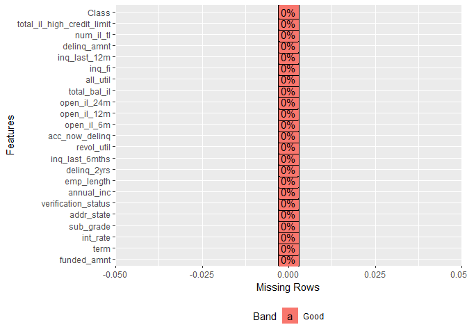
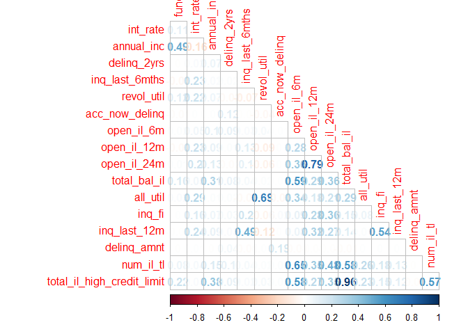

Handling Imbalance Data
================

### IMPORT LIBRARIES

``` r
library(tidyverse)
library(DataExplorer)
library(funModeling)
library(recipes)
library(caret)
library(yardstick)
library(gridExtra)
library(knitr)
library(corrplot)
library(correlationfunnel)
```

### IMPORT DATA

``` r
data('lending_club',package = 'parsnip')

#look at the data structure and dimension
glimpse(lending_club)
```

    ## Observations: 9,857
    ## Variables: 23
    ## $ funded_amnt                <int> 16100, 32000, 10000, 16800, 3500, 1...
    ## $ term                       <fct> term_36, term_60, term_36, term_60,...
    ## $ int_rate                   <dbl> 13.99, 11.99, 16.29, 13.67, 7.39, 1...
    ## $ sub_grade                  <fct> C4, C1, D1, C3, A4, B5, A1, B2, B3,...
    ## $ addr_state                 <fct> CT, MN, OH, NV, CA, TX, KY, MO, NY,...
    ## $ verification_status        <fct> Not_Verified, Verified, Source_Veri...
    ## $ annual_inc                 <dbl> 35000, 72000, 72000, 101000, 50100,...
    ## $ emp_length                 <fct> emp_5, emp_ge_10, emp_ge_10, emp_lt...
    ## $ delinq_2yrs                <int> 0, 0, 0, 0, 0, 0, 0, 2, 0, 1, 0, 0,...
    ## $ inq_last_6mths             <int> 0, 0, 2, 0, 0, 0, 0, 0, 2, 0, 3, 3,...
    ## $ revol_util                 <dbl> 67.4, 82.2, 74.2, 64.0, 78.3, 68.1,...
    ## $ acc_now_delinq             <int> 0, 0, 0, 0, 0, 0, 0, 0, 0, 0, 0, 0,...
    ## $ open_il_6m                 <int> 1, 5, 3, 6, 0, 1, 2, 8, 1, 0, 3, 1,...
    ## $ open_il_12m                <int> 0, 1, 2, 1, 0, 0, 0, 2, 0, 0, 1, 2,...
    ## $ open_il_24m                <int> 0, 3, 3, 2, 0, 0, 0, 5, 0, 0, 1, 5,...
    ## $ total_bal_il               <int> 1099, 49187, 33378, 55445, 0, 7574,...
    ## $ all_util                   <int> 48, 77, 79, 64, 78, 66, 54, 80, 75,...
    ## $ inq_fi                     <int> 0, 0, 1, 1, 0, 0, 0, 0, 2, 1, 1, 1,...
    ## $ inq_last_12m               <int> 3, 0, 4, 4, 0, 0, 0, 4, 6, 1, 3, 5,...
    ## $ delinq_amnt                <int> 0, 0, 0, 0, 0, 0, 0, 0, 0, 0, 0, 0,...
    ## $ num_il_tl                  <int> 3, 9, 9, 10, 3, 9, 7, 21, 7, 1, 7, ...
    ## $ total_il_high_credit_limit <int> 13193, 65945, 39387, 60188, 0, 1213...
    ## $ Class                      <fct> good, good, good, good, good, good,...

``` r
# check missing data
anyNA(lending_club)
```

    ## [1] FALSE

``` r
plot_missing(lending_club)
```

<!-- -->

Ther are no missing data.

``` r
#check the class distribution of target feature
table(lending_club$Class) %>% prop.table()
```

    ## 
    ##        bad       good 
    ## 0.05245004 0.94754996

There is a high class imbalance. The positive class, which is bad that
represents the borrowers being bad in their payment is only 5% compared
to around 95% of good borrowers.

``` r
# Divide the data into train and test sets with stratified sampling
set.seed(3456)
split_index <- createDataPartition(lending_club$Class,p=0.8,list = FALSE)
train_tbl <- lending_club[split_index,]
test_tbl <- lending_club[-split_index,]

# check the distribution of target in both train and test set
train_tbl$Class %>% table() %>% prop.table()
```

    ## .
    ##       bad      good 
    ## 0.0524981 0.9475019

``` r
test_tbl$Class %>% table() %>% prop.table()
```

    ## .
    ##        bad       good 
    ## 0.05225774 0.94774226

Before performing any data preprocessing lets create a benchmark model
initial model with Logistic regression

``` r
#create train control
tr_ctrl <- trainControl(method = "cv",number = 10,savePredictions = TRUE,
                        classProbs = TRUE,
                        summaryFunction = twoClassSummary)


# logistic regression model

set.seed(234)
model_initial <- train(Class ~ ., method = "glm",family = binomial,
                       data = train_tbl,
                       trControl = tr_ctrl,
                       metric = 'ROC')

model_initial$results %>% select(-1) %>% kable()
```

|       ROC |     Sens |     Spec |     ROCSD |    SensSD |    SpecSD |
| --------: | -------: | -------: | --------: | --------: | --------: |
| 0.7189382 | 0.009698 | 0.997992 | 0.0289894 | 0.0125212 | 0.0022087 |

We have a model with moderate AUC score of 0.7189. Lets evaluate the
model on test data.

``` r
# Prediction on test set
pred_test_prob <- predict(model_initial,newdata = test_tbl,type = 'prob')
pred_test_class <- predict(model_initial,newdata = test_tbl,type = 'raw')

# Evaluation metrics
eval_tbl <- pred_test_prob %>% as_tibble() %>% 
  bind_cols(true_class = test_tbl$Class,
            predict_class = pred_test_class)

tibble(accuracy = accuracy_vec(eval_tbl$true_class,eval_tbl$predict_class),
       sensitivity = sens_vec(eval_tbl$true_class,eval_tbl$predict_class),
       specificity = spec_vec(eval_tbl$true_class,eval_tbl$predict_class),
       AUC = roc_auc_vec(eval_tbl$true_class,eval_tbl$bad),
       PRAUC = pr_auc_vec(eval_tbl$true_class,eval_tbl$bad)) %>% 
  kable()
```

|  accuracy | sensitivity | specificity |       AUC |     PRAUC |
| --------: | ----------: | ----------: | --------: | --------: |
| 0.9467275 |   0.0194175 |   0.9978587 | 0.7039303 | 0.0995655 |

*ROC and PR-AUC PLOT*

``` r
#function to plot Roc and PRAUC plot
plot_roc <- function(eval_tbl,target_prop){
  auc_plot <- eval_tbl %>% 
  roc_curve(true_class,bad) %>% 
  ggplot(aes(1-specificity,sensitivity))+ 
  geom_line()+geom_abline(linetype = 2)+
  ggtitle("AUC Curve")
  
pr_plot <- eval_tbl %>% 
  pr_curve(true_class,bad) %>%
  ggplot(aes(recall,precision))+
  geom_line()+
  geom_hline(yintercept = target_prop,linetype = 2)+
  ggtitle("PR-Curve")

grid.arrange(auc_plot,pr_plot,ncol=2)
  
}
```

``` r
plot_roc(eval_tbl = eval_tbl,target_prop = 0.053)
```

    ## Warning: Removed 1 rows containing missing values (geom_path).

<!-- -->

We see that our inital model also performs moderately good with an AUC
score of 0.693 and low PRAUC of 0.107(base = 0.05). For imbalance data
PRAUC score is more useful in evaluating the model. Our model has a low
PRAUC score meaning it is not good at separating the two class.

*Confusion Matrix*

``` r
conf_mat(eval_tbl,true_class,predict_class) 
```

    ##           Truth
    ## Prediction  bad good
    ##       bad     2    4
    ##       good  101 1864

The model at a threshold 0f 0.5 tries to classifies every borrowers as
good.

### EXPLORATORY DATA ANALYSIS

``` r
#quick look at the features
df_status(train_tbl) 
```

    ##                      variable q_zeros p_zeros q_na p_na q_inf p_inf
    ## 1                 funded_amnt       0    0.00    0    0     0     0
    ## 2                        term       0    0.00    0    0     0     0
    ## 3                    int_rate       0    0.00    0    0     0     0
    ## 4                   sub_grade       0    0.00    0    0     0     0
    ## 5                  addr_state       0    0.00    0    0     0     0
    ## 6         verification_status       0    0.00    0    0     0     0
    ## 7                  annual_inc       1    0.01    0    0     0     0
    ## 8                  emp_length       0    0.00    0    0     0     0
    ## 9                 delinq_2yrs    6321   80.15    0    0     0     0
    ## 10             inq_last_6mths    4748   60.21    0    0     0     0
    ## 11                 revol_util      34    0.43    0    0     0     0
    ## 12             acc_now_delinq    7837   99.38    0    0     0     0
    ## 13                 open_il_6m     926   11.74    0    0     0     0
    ## 14                open_il_12m    4118   52.22    0    0     0     0
    ## 15                open_il_24m    2158   27.36    0    0     0     0
    ## 16               total_bal_il     878   11.13    0    0     0     0
    ## 17                   all_util      10    0.13    0    0     0     0
    ## 18                     inq_fi    4301   54.54    0    0     0     0
    ## 19               inq_last_12m    2035   25.81    0    0     0     0
    ## 20                delinq_amnt    7839   99.40    0    0     0     0
    ## 21                  num_il_tl     221    2.80    0    0     0     0
    ## 22 total_il_high_credit_limit     878   11.13    0    0     0     0
    ## 23                      Class       0    0.00    0    0     0     0
    ##       type unique
    ## 1  integer    807
    ## 2   factor      2
    ## 3  numeric     72
    ## 4   factor     35
    ## 5   factor     50
    ## 6   factor      3
    ## 7  numeric   1237
    ## 8   factor     12
    ## 9  integer     13
    ## 10 integer      6
    ## 11 numeric   1018
    ## 12 integer      3
    ## 13 integer     30
    ## 14 integer     13
    ## 15 integer     18
    ## 16 integer   6693
    ## 17 integer    131
    ## 18 integer     16
    ## 19 integer     23
    ## 20 integer     47
    ## 21 integer     63
    ## 22 integer   6389
    ## 23  factor      2

``` r
# Histograms for the numerical features
plot_histogram(train_tbl)
```

<!-- --><!-- -->

From the histogram plots we can see that most the features are right
skewed. Features acc\_now\_delinq and delinq\_amnt are highly skewed and
seems that they consits mostly of a zeros, which shows the behavior of
near zero variance. Both the features have almost 95% of values as zero.
We can remove these features based on near zero variance

Next we can see annual\_inc is also highly skewed and that could be due
to the presence of outliers

``` r
quantile(train_tbl$annual_inc)
```

    ##        0%       25%       50%       75%      100% 
    ##      0.00  49302.56  68000.00  95089.75 960000.00

``` r
train_tbl %>% ggplot(aes(y=annual_inc))+geom_boxplot()
```

<!-- -->

The maximum annula income is very high compared to the medium value and
it is suspectible that the annula income is so high. So, we treat them
as outliers and replace them with tukey method.

``` r
tukey_outlier(train_tbl$annual_inc)
```

    ## bottom_threshold    top_threshold 
    ##        -88059.01        232451.32

With tukey method (25% - 3*IQR OR 75% + 3*IQR) the maximum income cannot
exceed 234913.89

``` r
# replace outliers in train data with upper bound
train_tbl <- train_tbl %>% 
  mutate(annual_inc = prep_outliers(annual_inc,type = "stop",method = "tukey"))

#replace outliers in test data
test_tbl <- test_tbl %>% 
  mutate(annual_inc = ifelse(annual_inc >234913.89,234913.89,annual_inc))

# box plot of annual_inc after outlier treatment
train_tbl %>% ggplot(aes(y=annual_inc))+geom_boxplot()
```

<!-- -->

Now we see less outliers than before and the data is more spread. For
rest of the numerical features we will transform them with Yeojhonson
whilep reparing recpie for the modeling

``` r
# Bar plots for the categorical features

plot_bar(train_tbl)
```

<!-- -->

Features sub\_grade and addr\_state have high number of levels and it
can be problematic during modeling. We will reduce the levels for the
features. Similarly emp\_length also have cardinality problem as the
data is populate mostly by a single level, so will regroup it

``` r
# Reducing the sub_grade feature to a single grades
train_tbl <- train_tbl %>% 
  mutate(sub_grade = str_sub(sub_grade,start = 1,end = 1)) %>% 
  rename(grade = sub_grade) 

test_tbl <- test_tbl %>% 
  mutate(sub_grade = str_sub(sub_grade,start = 1,end = 1)) %>% 
  rename(grade = sub_grade) 
```

``` r
# Regrouping addr_state feature -remove bottom 40% levels
group_category(train_tbl,feature = 'addr_state',threshold = 0.4)
```

    ## # A tibble: 10 x 4
    ##    addr_state   cnt    pct cum_pct
    ##    <chr>      <int>  <dbl>   <dbl>
    ##  1 CA          1087 0.138    0.138
    ##  2 TX           705 0.0894   0.227
    ##  3 NY           615 0.0780   0.305
    ##  4 FL           579 0.0734   0.379
    ##  5 IL           327 0.0415   0.420
    ##  6 NJ           278 0.0353   0.455
    ##  7 OH           268 0.0340   0.489
    ##  8 GA           256 0.0325   0.522
    ##  9 NC           245 0.0311   0.553
    ## 10 PA           232 0.0294   0.582

So, we only keep top 60% of the levels in the feature and regroup bottom
40% as OTHER

``` r
# Regrouping emp_length
group_category(train_tbl,feature = 'emp_length',threshold = 0.3)
```

    ## # A tibble: 5 x 4
    ##   emp_length   cnt    pct cum_pct
    ##   <chr>      <int>  <dbl>   <dbl>
    ## 1 emp_ge_10   2744 0.348    0.348
    ## 2 emp_2        734 0.0931   0.441
    ## 3 emp_3        615 0.0780   0.519
    ## 4 emp_lt_1     594 0.0753   0.594
    ## 5 emp_unk      518 0.0657   0.660

For emp\_length we only keep top 70% of the levels in the feature and
regroup bottom 30% as OTHER, so that we have resonable number of levels

``` r
# Checking correlation between the features

train_tbl %>%
  select_if(is.numeric) %>% 
  cor(use = "complete.obs") %>% 
  corrplot(method = 'number',diag = FALSE,type = 'lower')
```

<!-- -->

From the correlation matrix, we can see total\_il\_high\_credit limit
and total\_bal\_il have high correlation. So, we can remove one of them

``` r
# Check correlation between the features and the target

# preprocessing the data for correlation funnel
cor_recipe <- recipe(Class ~ ., data = train_tbl) %>% 
  step_nzv(all_predictors()) %>% 
  step_other("addr_state",threshold = 0.0337) %>% 
  step_other("emp_length",threshold = 0.0658) %>% 
  prep(training = train_tbl,retain = TRUE)

cor_tbl <- juice(cor_recipe)

cor_tbl %>% 
  mutate_if(is.integer,as.numeric) %>% 
  binarize() %>% 
  correlate(target = "Class__bad") %>% 
  plot_correlation_funnel()
```

<!-- -->

int\_rate have the higest corelation to the target followed by grade.
Overall, most of the features have very low correlatio to the target.
Earlier we saw total\_il\_high\_credit limit and total\_bal\_il had high
correlation. Now, from the correlation funnel we see that total\_bal\_il
have higher corelation to the target, so we keep this and remove
total\_il\_high\_credit\_limit

### PREPARE MODEL RECIPIE

``` r
#final recipe for the modeling
model_recipe <- recipe(Class ~ ., data = train_tbl) %>% 
  step_nzv(all_predictors()) %>% 
  step_rm("total_il_high_credit_limit") %>% 
  step_other("addr_state",threshold = 0.0337) %>% 
  step_other("emp_length",threshold = 0.0658) %>% 
  step_sqrt(all_numeric()) %>% 
  prep(training = train_tbl,retain = TRUE)

# transform train data
train_df <- juice(model_recipe)

#transform test data
test_df <- bake(model_recipe,test_tbl)
```

Lets check the features after the tranformation

``` r
plot_histogram(train_df)
```

<!-- -->

``` r
plot_bar(train_df)
```

<!-- -->

### MODELING

We will build multiple models with caret pacakge. The models we will
trian are: - Linear Discriminant Analysis - Logistic Regression -
Decision Tree - Random Forest - Support Vector Machine - Naive bayes -
XgBoost

``` r
library(doParallel)
cl <- makePSOCKcluster(3)
registerDoParallel(cl)

#create train control
tr_ctrl <- trainControl(method = "cv",number = 10,
                        savePredictions = TRUE,
                        classProbs = TRUE,
                        summaryFunction = twoClassSummary,
                        allowParallel = TRUE)

# Linear Discriminant model
set.seed(234)
ldr_model <- train(Class~., method = "lda",
                   data = train_df,
                   preProcess = c('center','scale'),
                   trControl = tr_ctrl,
                   metric = "ROC")

# Logistic Regression
set.seed(234)
lr_model <- train(Class~., method = "glm",family = binomial,
                   data = train_df,
                   preProcess = c('center','scale'),
                   trControl = tr_ctrl,
                   metric = "ROC")

#Decision tree
set.seed(234)
tree_model <- train(Class~., method = "rpart",
                  data = train_df,
                  preProcess = c('center','scale'),
                  trControl = tr_ctrl,
                  metric = "ROC")

# Random Forest

set.seed(234)
Rf_model <- train(Class~., method = "ranger",
                  data = train_df,
                  preProcess = c('center','scale'),
                  trControl = tr_ctrl,
                  num.trees = 100,
                  metric = "ROC")

# Suppotr Vector Machine
set.seed(234)
svm_model <- train(Class~., method = "svmRadial",
                  data = train_df,
                  preProcess = c('center','scale'),
                  trControl = tr_ctrl,
                  metric = "ROC")

# Naive Bayes
set.seed(234)
Nb_model <- train(Class~., method = "nb",
                   data = train_df,
                   preProcess = c('center','scale'),
                   trControl = tr_ctrl,
                   metric = "ROC")

#Xgboost
set.seed(234)
xgb_model <- train(Class~., method = "xgbTree",
                   data = train_df,
                   preProcess = c('center','scale'),
                   trControl = tr_ctrl,
                   metric = "ROC")

stopCluster(cl)
```

**MODEL COMPARISON**

``` r
model_list <- list("LDA" = ldr_model,
                   'LR' = lr_model,
                   "DT" = tree_model,
                   "RF" = Rf_model,
                   "SVM" = svm_model,
                   "NB" = Nb_model,
                   "XGB" = xgb_model)

caret::resamples(model_list) %>% summary()
```

    ## 
    ## Call:
    ## summary.resamples(object = .)
    ## 
    ## Models: LDA, LR, DT, RF, SVM, NB, XGB 
    ## Number of resamples: 10 
    ## 
    ## ROC 
    ##          Min.   1st Qu.    Median      Mean   3rd Qu.      Max. NA's
    ## LDA 0.6874653 0.7232869 0.7435934 0.7431336 0.7737199 0.7771248    0
    ## LR  0.7040193 0.7222630 0.7531318 0.7438140 0.7636285 0.7689122    0
    ## DT  0.6350003 0.6531329 0.6610888 0.6643118 0.6786261 0.6961817    0
    ## RF  0.6686584 0.7100213 0.7269298 0.7240519 0.7376379 0.7706404    0
    ## SVM 0.5650570 0.5869261 0.5965248 0.5995956 0.6046966 0.6460154    0
    ## NB  0.6207595 0.7013108 0.7314729 0.7191136 0.7473186 0.7689774    0
    ## XGB 0.7081986 0.7324293 0.7515246 0.7478282 0.7613809 0.7916109    0
    ## 
    ## Sens 
    ##           Min.    1st Qu.     Median       Mean    3rd Qu.       Max. NA's
    ## LDA 0.02439024 0.04790941 0.07229965 0.06759582 0.07317073 0.11904762    0
    ## LR  0.00000000 0.00000000 0.00000000 0.00000000 0.00000000 0.00000000    0
    ## DT  0.00000000 0.00000000 0.02380952 0.01684088 0.02439024 0.04761905    0
    ## RF  0.00000000 0.00000000 0.00000000 0.00000000 0.00000000 0.00000000    0
    ## SVM 0.00000000 0.00000000 0.00000000 0.00000000 0.00000000 0.00000000    0
    ## NB  0.21428571 0.31707317 0.32520325 0.33101045 0.37500000 0.46341463    0
    ## XGB 0.00000000 0.00000000 0.00000000 0.00000000 0.00000000 0.00000000    0
    ## 
    ## Spec 
    ##          Min.   1st Qu.    Median      Mean   3rd Qu.      Max. NA's
    ## LDA 0.9785810 0.9832664 0.9859536 0.9863475 0.9879518 0.9986631    0
    ## LR  0.9986613 1.0000000 1.0000000 0.9998661 1.0000000 1.0000000    0
    ## DT  0.9825971 0.9882865 0.9912985 0.9908984 0.9929746 0.9986613    0
    ## RF  1.0000000 1.0000000 1.0000000 1.0000000 1.0000000 1.0000000    0
    ## SVM 0.9973226 1.0000000 1.0000000 0.9995984 1.0000000 1.0000000    0
    ## NB  0.8915663 0.8959170 0.9042838 0.9037739 0.9119813 0.9157754    0
    ## XGB 1.0000000 1.0000000 1.0000000 1.0000000 1.0000000 1.0000000    0

``` r
write_rds(model_list,'model_list.rds')
```

``` r
caret::resamples(model_list)%>% bwplot()
```

<!-- -->

The results show that we are able to do better thatn our benchmark
model. From the model comparison we see the best performing models in
terms of AUC score are Linear Discriminant Analysis, Logistic Regression
and Xgboost.However, LDA model have better sensitivity. Similarly, Naive
Bayes model identifies the positive class better thatn other models with
higher sensitivity and moderate AUC score.

As said earlier AUC score may not be the best metric for imbalanced
data, so we will calculate PRAUC score for the models and compare the
results.

**PRAUC SCORE ** from cross validation

``` r
#function to calculate pr-auc score from the cross validation results
calculate_pr.auc <- function(cv_predictions,model){
  cv_pr.auc <- cv_predictions %>% 
    as_tibble() %>% 
    group_by(Resample) %>% 
    summarise(pr.auc = pr_auc_vec(obs,bad)) %>% 
    mutate(model = model)
  
  return(cv_pr.auc)
}
```

``` r
pr_auc_tbl <- map2_df(.x = list(ldr_model$pred,lr_model$pred,tree_model$pred,Rf_model$pred,svm_model$pred,
                                xgb_model$pred,Nb_model$pred),
        .y = list("LDA","LR","DT","RF","SVM","XGB","NB"),
        .f = calculate_pr.auc)
```

``` r
# box plot of pr-auc from the cv results
pr_auc_tbl %>% 
  ggplot(aes(y = pr.auc))+
  geom_boxplot()+
  coord_flip()+
  facet_wrap(~model,scales = 'free')
```

<!-- -->

``` r
# summary of the pr_auc results
pr_auc_tbl %>% 
  group_by(model) %>% 
  summarise_at(.vars = 'pr.auc',
               .funs = c(min = min,median = median,mean = mean,max = max,sd = sd))
```

    ## # A tibble: 7 x 6
    ##   model     min median   mean   max     sd
    ##   <chr>   <dbl>  <dbl>  <dbl> <dbl>  <dbl>
    ## 1 DT    0.00394 0.157  0.167  0.417 0.143 
    ## 2 LDA   0.108   0.133  0.146  0.241 0.0363
    ## 3 LR    0.102   0.137  0.149  0.248 0.0404
    ## 4 NB    0.0670  0.0915 0.0965 0.164 0.0294
    ## 5 RF    0.0479  0.134  0.139  0.205 0.0497
    ## 6 SVM   0.0707  0.0962 0.0967 0.125 0.0207
    ## 7 XGB   0.0800  0.121  0.120  0.151 0.0174

Surprisingly now Decision tree performs better than other models with
respect to PRAUC score but has a high variance that may lead to
overfitting in the final test data. Lets see performance of the models
on test data .

### PREDICTION ON TEST DATA

``` r
# function to create evaluation results

get_evaluation <- function(model,test_data){
  pred_test_prob <- predict(model,test_data,type = 'prob')
  pred_test_class  <- predict(model,test_data,type = 'raw')
  
  eval_tbl <- pred_test_prob %>% as_tibble() %>% 
      bind_cols(true_class = test_data$Class,
                predict_class = pred_test_class)
  
  tibble(accuracy = accuracy_vec(eval_tbl$true_class,eval_tbl$predict_class),
       sensitivity = sens_vec(eval_tbl$true_class,eval_tbl$predict_class),
       specificity = spec_vec(eval_tbl$true_class,eval_tbl$predict_class),
       AUC = roc_auc_vec(eval_tbl$true_class,eval_tbl$bad),
       PRAUC = pr_auc_vec(eval_tbl$true_class,eval_tbl$bad))

}
```

``` r
eval_DT <- get_evaluation(tree_model,test_data = test_df) %>% mutate(model = 'DT')
eval_LDA <-get_evaluation(ldr_model,test_data = test_df)%>% mutate(model = 'LDA')
eval_LR <- get_evaluation(lr_model,test_data = test_df)%>% mutate(model = 'LR')
eval_RF <- get_evaluation(Rf_model,test_data = test_df) %>% mutate(model = 'RF')
eval_SVM <- get_evaluation(svm_model,test_data = test_df) %>% mutate(model = 'SVM')
eval_NB <- get_evaluation(Nb_model,test_data = test_df) %>% mutate(model = 'NB')
eval_XGB <- get_evaluation(xgb_model,test_data = test_df) %>% mutate(model = 'XGB')

bind_rows(eval_DT,eval_LDA,eval_LR,eval_RF,eval_SVM,eval_NB,eval_XGB) %>%
  select(model,everything())
```

    ## # A tibble: 7 x 6
    ##   model accuracy sensitivity specificity   AUC  PRAUC
    ##   <chr>    <dbl>       <dbl>       <dbl> <dbl>  <dbl>
    ## 1 DT       0.944     0.00971       0.995 0.698 0.208 
    ## 2 LDA      0.940     0.0874        0.987 0.741 0.125 
    ## 3 LR       0.948     0             1     0.750 0.118 
    ## 4 RF       0.948     0             1     0.727 0.111 
    ## 5 SVM      0.947     0             0.999 0.603 0.0833
    ## 6 NB       0.860     0.272         0.892 0.742 0.0907
    ## 7 XGB      0.948     0             1     0.753 0.121

Decision tree is still performing better than other models with respect
to PRAUC score with a fair AUC score of 0.698.

**AUC and PRAUC plot for Decision Tree**

``` r
pred_test_prob <- predict(tree_model,test_df,type = 'prob')
pred_test_class  <- predict(tree_model,test_df,type = 'raw')
  
eval_tbl_DT <- pred_test_prob %>% as_tibble() %>% 
      bind_cols(true_class = test_df$Class,
                predict_class = pred_test_class)

plot_roc(eval_tbl_DT,0.053)
```

    ## Warning: Removed 1 rows containing missing values (geom_path).

<!-- -->

**Precision vs Recall**

``` r
eval_tbl_DT %>% 
  pr_curve(true_class,bad) %>%
  ggplot(aes(.threshold))+
  geom_line(aes(y = precision,color = 'precision'))+
  geom_line(aes(y = recall,color = 'recall'))+
  labs(y = '')
```

    ## Warning: Removed 1 rows containing missing values (geom_path).

<!-- -->

\*\*COnfusion Matrix for DT\*

``` r
#function to plot confusion matrix
plot_cm <- function(eval_tbl,threshold,positive_class,negative_class){
  eval_tbl %>% 
     mutate(predict_class = ifelse(bad > 0.06,'bad','good') %>% as.factor(.)) %>% 
     mutate(type = case_when(
       true_class == positive_class & predict_class == positive_class ~ "TP",
       true_class == positive_class & predict_class == negative_class ~ "FN",
       true_class == negative_class & predict_class == positive_class ~ "FP",
       true_class == negative_class & predict_class == negative_class ~ "TN"
     )) %>% 
    ggplot(aes(true_class,bad,color = type))+
    geom_point(shape = 21)+
    geom_jitter()+
    geom_hline(yintercept = threshold,linetype = 2)+
    labs(title = str_glue("Confusion Matrix at {threshold}"), y ="predict")+
    theme_bw()
  
}
```

``` r
plot_cm(eval_tbl = eval_tbl_DT,threshold = 0.06,positive_class = 'bad',
        negative_class = 'good')
```

<!-- -->

**confusion matrix at 0.06 threshold**

``` r
eval_tbl_DT %>% 
  mutate(predict_class = ifelse(bad > 0.06,'bad','good') %>% as.factor(.)) %>% 
  conf_mat(true_class,predict_class)
```

    ##           Truth
    ## Prediction  bad good
    ##       bad    46  276
    ##       good   57 1592

**AUC and PRAUC plot for XGBoost**

``` r
pred_test_prob <- predict(xgb_model,test_df,type = 'prob')
pred_test_class  <- predict(xgb_model,test_df,type = 'raw')
  
eval_tbl_xgb <- pred_test_prob %>% as_tibble() %>% 
      bind_cols(true_class = test_df$Class,
                predict_class = pred_test_class)

plot_roc(eval_tbl = eval_tbl_xgb,target_prop = 0.053)
```

    ## Warning: Removed 1 rows containing missing values (geom_path).

<!-- -->

**Precision vs Recall for XGboost**

``` r
eval_tbl_xgb %>% 
  pr_curve(true_class,bad) %>%
  ggplot(aes(.threshold))+
  geom_line(aes(y = precision,color = 'precision'))+
  geom_line(aes(y = recall,color = 'recall'))+
  labs(y = '')
```

    ## Warning: Removed 1 rows containing missing values (geom_path).

<!-- -->

**Confusion Matrix for XGBoost**

``` r
plot_cm(eval_tbl = eval_tbl_xgb,threshold = 0.07,positive_class = 'bad',
        negative_class = 'good')
```

<!-- -->

**confusion matrix at 0.07**

``` r
eval_tbl %>% 
  mutate(predict_class = ifelse(bad > 0.07,'bad','good') %>% as.factor(.)) %>% 
  conf_mat(true_class,predict_class)
```

    ##           Truth
    ## Prediction  bad good
    ##       bad    49  405
    ##       good   54 1463

We can see that for a good recall the models have to make lot of false
positives, reducing the precision to vey low. Threfore at the moment our
models are not performing well, especially we have very low PRAUC score
and so we do not have a balance between recall and precision.

For very highly imbalance data, we may have to try resampling methods
for better results.
