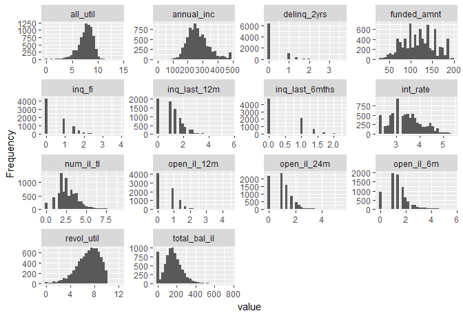

Resampling
================

### IMPORT LIBRARIES

``` r
library(tidyverse)
library(DataExplorer)
library(funModeling)
library(recipes)
library(caret)
library(yardstick)
library(gridExtra)
library(knitr)
library(corrplot)
```

### IMPORT DATA

``` r
data('lending_club',package = 'parsnip')

#look at the data structure and dimension
glimpse(lending_club)
```

    ## Observations: 9,857
    ## Variables: 23
    ## $ funded_amnt                <int> 16100, 32000, 10000, 16800, 3500, 1...
    ## $ term                       <fct> term_36, term_60, term_36, term_60,...
    ## $ int_rate                   <dbl> 13.99, 11.99, 16.29, 13.67, 7.39, 1...
    ## $ sub_grade                  <fct> C4, C1, D1, C3, A4, B5, A1, B2, B3,...
    ## $ addr_state                 <fct> CT, MN, OH, NV, CA, TX, KY, MO, NY,...
    ## $ verification_status        <fct> Not_Verified, Verified, Source_Veri...
    ## $ annual_inc                 <dbl> 35000, 72000, 72000, 101000, 50100,...
    ## $ emp_length                 <fct> emp_5, emp_ge_10, emp_ge_10, emp_lt...
    ## $ delinq_2yrs                <int> 0, 0, 0, 0, 0, 0, 0, 2, 0, 1, 0, 0,...
    ## $ inq_last_6mths             <int> 0, 0, 2, 0, 0, 0, 0, 0, 2, 0, 3, 3,...
    ## $ revol_util                 <dbl> 67.4, 82.2, 74.2, 64.0, 78.3, 68.1,...
    ## $ acc_now_delinq             <int> 0, 0, 0, 0, 0, 0, 0, 0, 0, 0, 0, 0,...
    ## $ open_il_6m                 <int> 1, 5, 3, 6, 0, 1, 2, 8, 1, 0, 3, 1,...
    ## $ open_il_12m                <int> 0, 1, 2, 1, 0, 0, 0, 2, 0, 0, 1, 2,...
    ## $ open_il_24m                <int> 0, 3, 3, 2, 0, 0, 0, 5, 0, 0, 1, 5,...
    ## $ total_bal_il               <int> 1099, 49187, 33378, 55445, 0, 7574,...
    ## $ all_util                   <int> 48, 77, 79, 64, 78, 66, 54, 80, 75,...
    ## $ inq_fi                     <int> 0, 0, 1, 1, 0, 0, 0, 0, 2, 1, 1, 1,...
    ## $ inq_last_12m               <int> 3, 0, 4, 4, 0, 0, 0, 4, 6, 1, 3, 5,...
    ## $ delinq_amnt                <int> 0, 0, 0, 0, 0, 0, 0, 0, 0, 0, 0, 0,...
    ## $ num_il_tl                  <int> 3, 9, 9, 10, 3, 9, 7, 21, 7, 1, 7, ...
    ## $ total_il_high_credit_limit <int> 13193, 65945, 39387, 60188, 0, 1213...
    ## $ Class                      <fct> good, good, good, good, good, good,...

``` r
#check the class distribution of target feature
table(lending_club$Class) %>% prop.table()
```

    ## 
    ##        bad       good 
    ## 0.05245004 0.94754996

There is a high class imbalance. The positive class, which is bad that
represents the borrowers being bad in their payment is only 5% compared
to around 95% of good borrowers.

``` r
# check missing data
anyNA(lending_club)
```

    ## [1] FALSE

``` r
plot_missing(lending_club)
```

<!-- -->

Ther are no missing data.

``` r
# Divide the data into train and test sets with stratified sampling
set.seed(3456)
split_index <- createDataPartition(lending_club$Class,p=0.8,list = FALSE)
train_tbl <- lending_club[split_index,]
test_tbl <- lending_club[-split_index,]

# check the distribution of target in both train and test set
train_tbl$Class %>% table() %>% prop.table()
```

    ## .
    ##       bad      good 
    ## 0.0524981 0.9475019

``` r
test_tbl$Class %>% table() %>% prop.table()
```

    ## .
    ##        bad       good 
    ## 0.05225774 0.94774226

### EXPLORATORY DATA ANALYSIS

``` r
#quick look at the features
df_status(train_tbl) 
```

    ##                      variable q_zeros p_zeros q_na p_na q_inf p_inf
    ## 1                 funded_amnt       0    0.00    0    0     0     0
    ## 2                        term       0    0.00    0    0     0     0
    ## 3                    int_rate       0    0.00    0    0     0     0
    ## 4                   sub_grade       0    0.00    0    0     0     0
    ## 5                  addr_state       0    0.00    0    0     0     0
    ## 6         verification_status       0    0.00    0    0     0     0
    ## 7                  annual_inc       1    0.01    0    0     0     0
    ## 8                  emp_length       0    0.00    0    0     0     0
    ## 9                 delinq_2yrs    6321   80.15    0    0     0     0
    ## 10             inq_last_6mths    4748   60.21    0    0     0     0
    ## 11                 revol_util      34    0.43    0    0     0     0
    ## 12             acc_now_delinq    7837   99.38    0    0     0     0
    ## 13                 open_il_6m     926   11.74    0    0     0     0
    ## 14                open_il_12m    4118   52.22    0    0     0     0
    ## 15                open_il_24m    2158   27.36    0    0     0     0
    ## 16               total_bal_il     878   11.13    0    0     0     0
    ## 17                   all_util      10    0.13    0    0     0     0
    ## 18                     inq_fi    4301   54.54    0    0     0     0
    ## 19               inq_last_12m    2035   25.81    0    0     0     0
    ## 20                delinq_amnt    7839   99.40    0    0     0     0
    ## 21                  num_il_tl     221    2.80    0    0     0     0
    ## 22 total_il_high_credit_limit     878   11.13    0    0     0     0
    ## 23                      Class       0    0.00    0    0     0     0
    ##       type unique
    ## 1  integer    807
    ## 2   factor      2
    ## 3  numeric     72
    ## 4   factor     35
    ## 5   factor     50
    ## 6   factor      3
    ## 7  numeric   1237
    ## 8   factor     12
    ## 9  integer     13
    ## 10 integer      6
    ## 11 numeric   1018
    ## 12 integer      3
    ## 13 integer     30
    ## 14 integer     13
    ## 15 integer     18
    ## 16 integer   6693
    ## 17 integer    131
    ## 18 integer     16
    ## 19 integer     23
    ## 20 integer     47
    ## 21 integer     63
    ## 22 integer   6389
    ## 23  factor      2

``` r
# Histograms for the numerical features
plot_histogram(train_tbl)
```

<!-- --><!-- -->

From the histogram plots we can see that most the features are right
skewed. Features acc\_now\_delinq and delinq\_amnt are highly skewed and
seems that they consits mostly of a zeros, which shows the behavior of
near zero variance. Both the features have almost 95% of values as zero.
We can remove these features based on near zero variance

Next we can see annual\_inc is also highly skewed and that could be due
to the presence of outliers

``` r
quantile(train_tbl$annual_inc)
```

    ##        0%       25%       50%       75%      100% 
    ##      0.00  49302.56  68000.00  95089.75 960000.00

``` r
train_tbl %>% ggplot(aes(y=annual_inc))+geom_boxplot()
```

<!-- -->

The maximum annula income is very high compared to the medium value and
it is suspectible that the annula income is so high. So, we treat them
as outliers and replace them with tukey method.

``` r
tukey_outlier(train_tbl$annual_inc)
```

    ## bottom_threshold    top_threshold 
    ##        -88059.01        232451.32

With tukey method (25% - 3*IQR OR 75% + 3*IQR) the maximum income cannot
exceed 234913.89

``` r
# replace outliers in train data with upper bound
train_tbl <- train_tbl %>% 
  mutate(annual_inc = prep_outliers(annual_inc,type = "stop",method = "tukey"))

#replace outliers in test data
test_tbl <- test_tbl %>% 
  mutate(annual_inc = ifelse(annual_inc >234913.89,234913.89,annual_inc))

# box plot of annual_inc after outlier treatment
train_tbl %>% ggplot(aes(y=annual_inc))+geom_boxplot()
```

<!-- -->

Now we see less outliers than before and the data is more spread. For
rest of the numerical features we will transform them with Yeojhonson
while preparing recpie for the modeling

``` r
# Bar plots for the categorical features

plot_bar(train_tbl)
```

<!-- -->

Features sub\_grade and addr\_state have high number of levels and it
can be problematic during modeling. We will reduce the levels for the
features. Similarly emp\_length also have cardinality problem as the
data is populate mostly by a single level, so will regroup it

``` r
# Reducing the sub_grade feature to a single grades
train_tbl <- train_tbl %>% 
  mutate(sub_grade = str_sub(sub_grade,start = 1,end = 1)) %>% 
  rename(grade = sub_grade) 

test_tbl <- test_tbl %>% 
  mutate(sub_grade = str_sub(sub_grade,start = 1,end = 1)) %>% 
  rename(grade = sub_grade) 
```

``` r
# Regrouping addr_state feature - remove bottom 40% levels
group_category(train_tbl,feature = 'addr_state',threshold = 0.4)
```

    ## # A tibble: 10 x 4
    ##    addr_state   cnt    pct cum_pct
    ##    <chr>      <int>  <dbl>   <dbl>
    ##  1 CA          1087 0.138    0.138
    ##  2 TX           705 0.0894   0.227
    ##  3 NY           615 0.0780   0.305
    ##  4 FL           579 0.0734   0.379
    ##  5 IL           327 0.0415   0.420
    ##  6 NJ           278 0.0353   0.455
    ##  7 OH           268 0.0340   0.489
    ##  8 GA           256 0.0325   0.522
    ##  9 NC           245 0.0311   0.553
    ## 10 PA           232 0.0294   0.582

So, we only keep top 60% of the levels in the feature and regroup bottom
40% as OTHER

``` r
# Regrouping emp_length
group_category(train_tbl,feature = 'emp_length',threshold = 0.3)
```

    ## # A tibble: 5 x 4
    ##   emp_length   cnt    pct cum_pct
    ##   <chr>      <int>  <dbl>   <dbl>
    ## 1 emp_ge_10   2744 0.348    0.348
    ## 2 emp_2        734 0.0931   0.441
    ## 3 emp_3        615 0.0780   0.519
    ## 4 emp_lt_1     594 0.0753   0.594
    ## 5 emp_unk      518 0.0657   0.660

For emp\_length we only keep top 70% of the levels in the feature and
regroup bottom 30% as OTHER, so that we have resonable number of levels

``` r
# Checking correlation between the features

train_tbl %>%
  select_if(is.numeric) %>% 
  cor(use = "complete.obs") %>% 
  corrplot(method = 'number',diag = FALSE,type = 'lower')
```

<!-- -->

From the correlation matrix, we can see total\_il\_high\_credit limit
and total\_bal\_il have high correlation. So, we can remove one of them

### PREPARE MODEL RECIPIE

``` r
#final recipe for the modeling
model_recipe <- recipe(Class ~ ., data = train_tbl) %>% 
  step_nzv(all_predictors()) %>% 
  step_rm("total_il_high_credit_limit") %>% 
  step_other("addr_state",threshold = 0.0337) %>% 
  step_other("emp_length",threshold = 0.0658) %>% 
  step_sqrt(all_numeric()) %>% 
  prep(training = train_tbl,retain = TRUE)

# transform train data
train_df <- juice(model_recipe)

#transform test data
test_df <- bake(model_recipe,test_tbl)
```

Lets check the features after the tranformation

``` r
plot_histogram(train_df)
```

<!-- -->

``` r
plot_bar(train_df)
```

<!-- -->

### MODELING

Logisitc Regression has shown to be good enough for modeling this data,
show we will use it for the modeling.

``` r
#create train control
tr_ctrl <- trainControl(method = "cv",number = 10,
                        savePredictions = TRUE,
                        classProbs = TRUE,
                        summaryFunction = twoClassSummary,
                        allowParallel = TRUE)

# Logistic Regression
set.seed(234)
lr_model <- train(Class~., method = "glm",family = binomial,
                   data = train_df,
                   preProcess = c('center','scale'),
                   trControl = tr_ctrl,
                   metric = "ROC")
```

**Model Result**

``` r
lr_model$results %>% select(-1)
```

    ##        ROC Sens      Spec      ROCSD SensSD       SpecSD
    ## 1 0.743814    0 0.9998661 0.02422464      0 0.0004233303

We see the Logistic Regression has a moderate AUC of 0.74, but at the
current threshold of 0.5 its sensitivity is 0, meaning it classifies
everything to be negative. Lets also see the PR-AUC score as it is
considered to be more meaninigful for imbalance clasees.

``` r
# PR-AUC from the cross validated results

get_pr_auc <- function(model){
    model$pred%>% 
    as_tibble() %>% 
    group_by(Resample) %>% 
    summarise(pr.auc = pr_auc_vec(obs,bad)) %>% 
    summarise_at(.vars = 'pr.auc',.funs = c('min' = min,'max' = max, 'median'=median, 'mean'=mean,'sd'=sd))
}

get_pr_auc(lr_model)
```

    ## # A tibble: 1 x 5
    ##     min   max median  mean     sd
    ##   <dbl> <dbl>  <dbl> <dbl>  <dbl>
    ## 1 0.102 0.248  0.137 0.149 0.0404

The PR-AUC score for the model is low (base score = 0.05).

**Evaluating on test data**

``` r
# function to create evaluation results

get_evaluation <- function(model,test_data){
  pred_test_prob <- predict(model,test_data,type = 'prob')
  pred_test_class  <- predict(model,test_data,type = 'raw')
  
  eval_tbl <- pred_test_prob %>% as_tibble() %>% 
      bind_cols(true_class = test_data$Class,
                predict_class = pred_test_class)
  
  tibble(accuracy = accuracy_vec(eval_tbl$true_class,eval_tbl$predict_class),
       sensitivity = sens_vec(eval_tbl$true_class,eval_tbl$predict_class),
       specificity = spec_vec(eval_tbl$true_class,eval_tbl$predict_class),
       AUC = roc_auc_vec(eval_tbl$true_class,eval_tbl$bad),
       PRAUC = pr_auc_vec(eval_tbl$true_class,eval_tbl$bad))

}

get_evaluation(lr_model,test_data = test_df)
```

    ## # A tibble: 1 x 5
    ##   accuracy sensitivity specificity   AUC PRAUC
    ##      <dbl>       <dbl>       <dbl> <dbl> <dbl>
    ## 1    0.948           0           1 0.750 0.118

We see a similar result in test data with even lower PR-AUC score.

**Confusion Matrix at 0.5 threshold**

``` r
pred_test <- predict(lr_model,test_df)

confusionMatrix(pred_test,test_df$Class)
```

    ## Confusion Matrix and Statistics
    ## 
    ##           Reference
    ## Prediction  bad good
    ##       bad     0    0
    ##       good  103 1868
    ##                                          
    ##                Accuracy : 0.9477         
    ##                  95% CI : (0.937, 0.9571)
    ##     No Information Rate : 0.9477         
    ##     P-Value [Acc > NIR] : 0.5262         
    ##                                          
    ##                   Kappa : 0              
    ##  Mcnemar's Test P-Value : <2e-16         
    ##                                          
    ##             Sensitivity : 0.00000        
    ##             Specificity : 1.00000        
    ##          Pos Pred Value :     NaN        
    ##          Neg Pred Value : 0.94774        
    ##              Prevalence : 0.05226        
    ##          Detection Rate : 0.00000        
    ##    Detection Prevalence : 0.00000        
    ##       Balanced Accuracy : 0.50000        
    ##                                          
    ##        'Positive' Class : bad            
    ## 

**Feature Importance**

``` r
varImp(lr_model) %>% plot()
```

<!-- -->

``` r
features <- c("term","inq_last_6mths","int_rate","open_il_12m","annual_inc","emp_length",
              "inq_fi","revol_util","num_il_tl")

set.seed(234)
lr_new_model <- train(Class~., method = "glm",family = binomial,
                   data = train_df %>% select(Class,one_of(features)),
                   preProcess = c('center','scale'),
                   trControl = tr_ctrl,
                   metric = "ROC")

lr_new_model$results %>% select(-1)
```

    ##         ROC        Sens      Spec     ROCSD      SensSD       SpecSD
    ## 1 0.7531861 0.002380952 0.9997323 0.0261376 0.007529233 0.0005644405

We see a sligth imporvement in AUC score with feature selection.

``` r
# pr-auc
get_pr_auc(lr_new_model)
```

    ## # A tibble: 1 x 5
    ##     min   max median  mean     sd
    ##   <dbl> <dbl>  <dbl> <dbl>  <dbl>
    ## 1 0.113 0.231  0.139 0.149 0.0326

``` r
#performance on test data
get_evaluation(model = lr_new_model,test_data = test_df %>% select(Class,one_of(features)))
```

    ## # A tibble: 1 x 5
    ##   accuracy sensitivity specificity   AUC PRAUC
    ##      <dbl>       <dbl>       <dbl> <dbl> <dbl>
    ## 1    0.948           0           1 0.762 0.124

Also a small improvement in test data.

``` r
train_df <- train_df %>% select(Class,one_of(features))
test_df  <- test_df %>% select(Class,one_of(features))
```

### Modling with Resampling

**Down Sampling**

``` r
set.seed(234)
tr_ctrl$sampling = 'down'
lr_down_model <- train(Class~., method = "glm",family = binomial,
                   data = train_df,
                   preProcess = c('center','scale'),
                   trControl = tr_ctrl,
                   metric = "ROC")
```

**Over Sampling**

``` r
set.seed(234)
tr_ctrl$sampling = 'up'
lr_over_model <- train(Class~., method = "glm",family = binomial,
                   data = train_df,
                   preProcess = c('center','scale'),
                   trControl = tr_ctrl,
                   metric = "ROC")
```

**somte sampling**

``` r
set.seed(234)
tr_ctrl$sampling = 'smote'
lr_smote_model <- train(Class~., method = "glm",family = binomial,
                   data = train_df,
                   preProcess = c('center','scale'),
                   trControl = tr_ctrl,
                   metric = "ROC")
```

    ## Warning: package 'DMwR' was built under R version 3.4.4

**Comparisn of the Resampling results**

``` r
# Auc comparison
resamples((list("Down"=lr_down_model, "Over"=lr_over_model,
                "Smote" = lr_smote_model))) %>% 
            bwplot()
```

<!-- -->

``` r
map_df(list(lr_down_model, lr_over_model,lr_smote_model),'results') %>% 
  mutate(Resampling = c("Down", "Under","Smote")) %>% 
  select( -parameter,Resampling, everything())
```

    ##         ROC      Sens      Spec      ROCSD     SensSD      SpecSD
    ## 1 0.7503564 0.6765970 0.6953939 0.02758012 0.05440097 0.014832886
    ## 2 0.7547227 0.6958769 0.6941925 0.02472802 0.04979695 0.011766439
    ## 3 0.7522542 0.5678862 0.7748933 0.02325630 0.05651709 0.009757208
    ##   Resampling parameter
    ## 1       Down      none
    ## 2      Under      none
    ## 3      Smote      none

``` r
# PR-Auc comparison
map_df(list("Down" = lr_down_model, "Over" = lr_over_model,
            "Smote" = lr_smote_model),get_pr_auc) %>% 
  mutate(Resampling = c("Down", "Under","Smote")) %>% 
  select(Resampling, everything())
```

    ## # A tibble: 3 x 6
    ##   Resampling   min   max median  mean     sd
    ##   <chr>      <dbl> <dbl>  <dbl> <dbl>  <dbl>
    ## 1 Down       0.118 0.213  0.141 0.148 0.0286
    ## 2 Under      0.112 0.242  0.140 0.151 0.0364
    ## 3 Smote      0.114 0.222  0.139 0.146 0.0314

The results does not improve as we see only a small improvement in AUC
and PR-auc with over samling method.

**Evaluation on test set**

``` r
get_evaluation(lr_over_model,test_df)
```

    ## # A tibble: 1 x 5
    ##   accuracy sensitivity specificity   AUC PRAUC
    ##      <dbl>       <dbl>       <dbl> <dbl> <dbl>
    ## 1    0.705       0.699       0.706 0.762 0.124

### Applying weight of Evidence to trnsform the features

``` r
library(scorecard)

# select features based on information value(>0.02)
train_iv_df <- var_filter(train_df,y = "Class")
```

    ## [INFO] filtering variables ...

``` r
glimpse(train_iv_df)
```

    ## Observations: 7,886
    ## Variables: 9
    ## $ inq_last_6mths <dbl> 0.000000, 1.414214, 0.000000, 0.000000, 0.00000...
    ## $ int_rate       <dbl> 3.740321, 4.036087, 3.697296, 2.718455, 3.38673...
    ## $ open_il_12m    <dbl> 0.000000, 1.414214, 1.000000, 0.000000, 0.00000...
    ## $ annual_inc     <dbl> 187.0829, 268.3282, 317.8050, 223.8303, 178.885...
    ## $ emp_length     <fct> other, emp_ge_10, emp_lt_1, other, emp_lt_1, ot...
    ## $ inq_fi         <dbl> 0.000000, 1.000000, 1.000000, 0.000000, 0.00000...
    ## $ revol_util     <dbl> 8.209750, 8.613942, 8.000000, 8.848729, 8.25227...
    ## $ num_il_tl      <dbl> 1.732051, 3.000000, 3.162278, 1.732051, 3.00000...
    ## $ Class          <int> 0, 0, 0, 0, 0, 0, 0, 0, 0, 0, 1, 0, 0, 0, 0, 0,...

Based on the low information value variable ‘term’ was removed

``` r
# creating bins for woe tranndformation
woe_bin <- woebin(dt = train_iv_df,y = 'Class',positive = "bad|1")
```

    ## [INFO] creating woe binning ...

    ## Warning in max(total_iv): no non-missing arguments to max; returning -Inf

``` r
# trasnform the train data with the woe bins created

train_woe <- woebin_ply(dt = train_iv_df, bins = woe_bin)
```

    ## [INFO] converting into woe values ...

``` r
glimpse(train_woe)
```

    ## Observations: 7,886
    ## Variables: 9
    ## $ Class              <int> 0, 0, 0, 0, 0, 0, 0, 0, 0, 0, 1, 0, 0, 0, 0...
    ## $ inq_last_6mths_woe <dbl> -0.3524329, 0.5979416, -0.3524329, -0.35243...
    ## $ int_rate_woe       <dbl> 0.5935968, 0.5935968, -0.5797156, -2.215487...
    ## $ open_il_12m_woe    <dbl> -0.4174910, 0.2290783, 0.2290783, -0.417491...
    ## $ annual_inc_woe     <dbl> 0.09559522, -0.14010667, 0.10086493, 0.0955...
    ## $ emp_length_woe     <dbl> 0.09085143, -0.14918210, 0.18140468, 0.0908...
    ## $ inq_fi_woe         <dbl> -0.20359543, 0.01627533, 0.01627533, -0.203...
    ## $ revol_util_woe     <dbl> -0.30776704, 0.25030690, -0.30776704, 0.250...
    ## $ num_il_tl_woe      <dbl> -0.008288783, 0.067104816, 0.067104816, -0....

``` r
# create the model with woe features

# transform class to factor
train_woe <- train_woe %>% 
  mutate(Class = ifelse(Class ==1, 'bad', 'good') %>% as.factor(.))

#set the sampling to over sampling
tr_ctrl$sampling = 'up'

lr_woe_model <- train(Class ~ . , method = 'glm', family = 'binomial',
                      data = train_woe,
                      trControl = tr_ctrl,
                      metric = 'ROC')
```

``` r
lr_woe_model$results
```

    ##   parameter       ROC      Sens      Spec      ROCSD     SensSD     SpecSD
    ## 1      none 0.7587039 0.7101045 0.6931192 0.02468316 0.07057219 0.01633432

``` r
get_pr_auc(lr_woe_model)
```

    ## # A tibble: 1 x 5
    ##     min   max median  mean     sd
    ##   <dbl> <dbl>  <dbl> <dbl>  <dbl>
    ## 1 0.122 0.227  0.149 0.155 0.0332

Again we can only see a small improvement.

``` r
# evaluation on test set

#transform test set to woe features

test_df <- test_df %>% select(-term)

test_woe <- woebin_ply(dt = test_df, bins = woe_bin)
```

    ## [INFO] converting into woe values ...

``` r
get_evaluation(lr_woe_model,test_woe)
```

    ## # A tibble: 1 x 5
    ##   accuracy sensitivity specificity   AUC PRAUC
    ##      <dbl>       <dbl>       <dbl> <dbl> <dbl>
    ## 1    0.693       0.670       0.694 0.724 0.109

The results for the test set is now worse than cross validation results,
so there may be overfitting.
