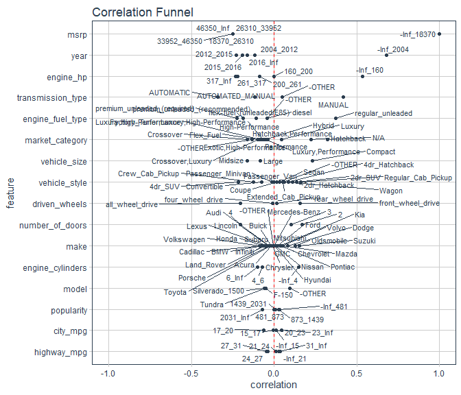

MODELING WITH TIDYMODELS
================

# 1\. LIBRARIES —-

``` r
# Tidymodels
library(tune)
library(dials)
library(parsnip)
library(rsample)
library(recipes)
library(textrecipes)
library(yardstick)
library(vip)

# Data Cleaning
library(janitor)

# EDA 
library(skimr)
library(correlationfunnel)
library(DataExplorer)

# ggplot2 Helpers
library(gghighlight)
library(patchwork)
library(ggthemes)

# Core
library(tidyverse)
library(tidyquant)
library(knitr)
```

# 2\. DATA OVERVIEW

Importing the data and having a quick look at the first five rows of the
data.

``` r
car_prices_tbl <- read.csv('data.csv') %>% 
  clean_names() %>% 
  select(msrp, everything())

car_prices_tbl %>% 
  head(5) %>% 
  kable()
```

|  msrp | make | model      | year | engine\_fuel\_type          | engine\_hp | engine\_cylinders | transmission\_type | driven\_wheels   | number\_of\_doors | market\_category                      | vehicle\_size | vehicle\_style | highway\_mpg | city\_mpg | popularity |
| ----: | :--- | :--------- | ---: | :-------------------------- | ---------: | ----------------: | :----------------- | :--------------- | ----------------: | :------------------------------------ | :------------ | :------------- | -----------: | --------: | ---------: |
| 46135 | BMW  | 1 Series M | 2011 | premium unleaded (required) |        335 |                 6 | MANUAL             | rear wheel drive |                 2 | Factory Tuner,Luxury,High-Performance | Compact       | Coupe          |           26 |        19 |       3916 |
| 40650 | BMW  | 1 Series   | 2011 | premium unleaded (required) |        300 |                 6 | MANUAL             | rear wheel drive |                 2 | Luxury,Performance                    | Compact       | Convertible    |           28 |        19 |       3916 |
| 36350 | BMW  | 1 Series   | 2011 | premium unleaded (required) |        300 |                 6 | MANUAL             | rear wheel drive |                 2 | Luxury,High-Performance               | Compact       | Coupe          |           28 |        20 |       3916 |
| 29450 | BMW  | 1 Series   | 2011 | premium unleaded (required) |        230 |                 6 | MANUAL             | rear wheel drive |                 2 | Luxury,Performance                    | Compact       | Coupe          |           28 |        18 |       3916 |
| 34500 | BMW  | 1 Series   | 2011 | premium unleaded (required) |        230 |                 6 | MANUAL             | rear wheel drive |                 2 | Luxury                                | Compact       | Convertible    |           28 |        18 |       3916 |

## 2.1 Engine Horsepower vs MSRP

msrp (vehicle price) is the target variable, which is what customers on
average pay for the vehicle, and engine\_hp(Engine horsepower) is a
measure of product performance.

``` r
cars_plot_data_tbl <- car_prices_tbl %>% 
  mutate(make_model = str_c(make, ' ', model)) %>%
  select(msrp, engine_hp, make_model)

cars_plot_data_tbl %>% 
  ggplot(aes(engine_hp, msrp))+
  geom_point(color = palette_light()[1], alpha = 0.3)+
  geom_smooth(method = 'lm')+
  scale_y_log10(label = scales::dollar)+
  labs(title = "Engine Horsepower vs MSRP",
       x = "Engine HP", y = "MSRP (log scale)")+
  theme_tq()
```

<!-- -->

Here, we see a positive correlation between the engine\_hp and msrp, the
price increases with the increase in the engine\_hp. Also, we can see
there are two groups in the plot. Lets look at the groups and find out
some more information.

Looking from the plot, we will create the two groups as : - Vehicles
with MSRP greater than $650,000 - Vehicles with Engine HP greater than
350 and MSRP less than $10,000

``` r
p1 <- cars_plot_data_tbl %>% 
  ggplot(aes(engine_hp, msrp))+
  geom_point(color = palette_light()[1], alpha = 0.3)+
  scale_y_log10(label = scales::dollar)+
  gghighlight(msrp> 650000, label_key = make_model,
              unhighlighted_colour = alpha('grey', 0.5),
              label_params = list(size=2.5))+
  theme_tq()+
  labs(title = "Vehicles with MSRP > $650K", 
       x = "Engine HP", y = "MSRP (log scale)")

p2 <- cars_plot_data_tbl %>% 
  ggplot(aes(engine_hp, msrp))+
  geom_point(color = palette_light()[1], alpha = 0.3)+
  scale_y_log10(label = scales::dollar)+
  gghighlight(engine_hp >350, msrp < 10000, label_key = make_model,
              unhighlighted_colour = alpha('grey', 0.5),
              label_params = list(size=2.5))+
  theme_tq()+
  labs(title = "Vehicles with MSRP < $10K and Engine HP > 350", 
       x = "Engine HP", y = "MSRP (log scale)")

# patchwork for stacking ggplots
p1 /p2
```

<!-- -->

From the two plots we can see that : - The first group makes total sense
- Lamborghini, Bugatti and Maybach. These are all super-luxury vehicles
and therefore have higher prices. - The second group is more interesting
- It’s BMW 8 Series, Mercedes-Benz 600-Class. This is odd because these
vehicles normally have a higher starting price. We will figure out the
cause for this.

## 2.2 Correlation Analysis

``` r
car_prices_tbl %>% 
  drop_na(engine_hp, engine_cylinders, number_of_doors, engine_fuel_type) %>% 
  mutate_if(is.integer, as.numeric) %>% 
  binarize(n_bins = 5) %>% 
  correlate(`msrp__-Inf_18370`) %>% 
  plot_correlation_funnel()
```

<!-- -->

As we can see the plot is a bit difficult to read due to too many
feature labels. We will break down the information and display it for
more readabiity.

``` r
car_prices_tbl %>% 
  drop_na(engine_hp, engine_cylinders, number_of_doors, engine_fuel_type) %>% 
  mutate_if(is.integer, as.numeric) %>% 
  binarize(n_bins = 5) %>% 
  correlate(`msrp__-Inf_18370`) %>% 
  filter(abs(correlation) > 0.06) %>% 
  mutate(Feature_Bin = str_c(feature, '__', bin),
         correlation_type = ifelse(correlation > 0, 'Postitve', 'Negative')) %>% 
  mutate(Feature_Bin = fct_reorder(Feature_Bin, correlation)) %>% 
  filter(Feature_Bin != 'msrp__-Inf_18370') %>% 
  ggplot(aes(Feature_Bin, correlation, fill = correlation_type))+
  geom_col(width = 0.5)+
  coord_flip()+
  scale_fill_tableau()+
  theme_tq()+
  theme(axis.text.y = element_text(size = 7),
        legend.position = 'right')+
  labs(title = 'Corrleation of Features with msrp less than $18370',
       subtitle = "Showing correlation above (+-) 0.6")
```

<!-- -->

We can see that Vehicle Year less than 2004 is highly correlated with
Vehicle Price (MSRP) less than $18,372, meaning more old is the veichle
the price is also less. This explains why some of the 600 Series
Mercedes-Benz vehicles (luxury brand) are in the low price group.

Lets confirm our finding by comparing the relation between msrp and
engine\_hp based on the age of the veivhles.

## 2.3 Engine HP, MSRP by Vehicle Age

``` r
car_plot_data_tbl <- car_prices_tbl %>% 
  mutate(make_model = str_c(make, " ", model),
         year_comparison = ifelse(year <= 2000, "2000 or Older", "2000 or Newer")
  ) %>%
  select(msrp, year_comparison, engine_hp, make_model) 


car_plot_data_tbl %>% 
  ggplot(aes(engine_hp, msrp, color = year_comparison))+
  geom_point(alpha = 0.05)+
  geom_smooth(method = 'lm')+
  scale_color_tq()+
  scale_y_log10(label = scales::dollar)+
  theme_tq()+
  labs(title = "Engine Horsepower vs MSRP by Vehicle Age",
       x = "Engine HP", y = "MSRP (log scale)")
```

<!-- -->

Now from the plot we can confirm the older veichles are prices low
compare to newer veichle.

# 3.0 Exploratory Data Analysis

## 3.1 Data Summary

``` r
skim(car_prices_tbl)
```

|                                                  |                  |
| :----------------------------------------------- | :--------------- |
| Name                                             | car\_prices\_tbl |
| Number of rows                                   | 11914            |
| Number of columns                                | 16               |
| \_\_\_\_\_\_\_\_\_\_\_\_\_\_\_\_\_\_\_\_\_\_\_   |                  |
| Column type frequency:                           |                  |
| factor                                           | 8                |
| numeric                                          | 8                |
| \_\_\_\_\_\_\_\_\_\_\_\_\_\_\_\_\_\_\_\_\_\_\_\_ |                  |
| Group variables                                  | None             |

Data summary

**Variable type: factor**

| skim\_variable     | n\_missing | complete\_rate | ordered | n\_unique | top\_counts                                |
| :----------------- | ---------: | -------------: | :------ | --------: | :----------------------------------------- |
| make               |          0 |              1 | FALSE   |        48 | Che: 1123, For: 881, Vol: 809, Toy: 746    |
| model              |          0 |              1 | FALSE   |       915 | Sil: 156, Tun: 140, F-1: 126, Sie: 90      |
| engine\_fuel\_type |          0 |              1 | FALSE   |        11 | reg: 7172, pre: 2009, pre: 1523, fle: 899  |
| transmission\_type |          0 |              1 | FALSE   |         5 | AUT: 8266, MAN: 2935, AUT: 626, DIR: 68    |
| driven\_wheels     |          0 |              1 | FALSE   |         4 | fro: 4787, rea: 3371, all: 2353, fou: 1403 |
| market\_category   |          0 |              1 | FALSE   |        72 | N/A: 3742, Cro: 1110, Fle: 872, Lux: 855   |
| vehicle\_size      |          0 |              1 | FALSE   |         3 | Com: 4764, Mid: 4373, Lar: 2777            |
| vehicle\_style     |          0 |              1 | FALSE   |        16 | Sed: 3048, 4dr: 2488, Cou: 1211, Con: 793  |

**Variable type: numeric**

| skim\_variable    | n\_missing | complete\_rate |     mean |       sd |   p0 |   p25 |   p50 |      p75 |    p100 | hist  |
| :---------------- | ---------: | -------------: | -------: | -------: | ---: | ----: | ----: | -------: | ------: | :---- |
| msrp              |          0 |           1.00 | 40594.74 | 60109.10 | 2000 | 21000 | 29995 | 42231.25 | 2065902 | ▇▁▁▁▁ |
| year              |          0 |           1.00 |  2010.38 |     7.58 | 1990 |  2007 |  2015 |  2016.00 |    2017 | ▁▁▂▂▇ |
| engine\_hp        |         69 |           0.99 |   249.39 |   109.19 |   55 |   170 |   227 |   300.00 |    1001 | ▇▆▁▁▁ |
| engine\_cylinders |         30 |           1.00 |     5.63 |     1.78 |    0 |     4 |     6 |     6.00 |      16 | ▁▇▂▁▁ |
| number\_of\_doors |          6 |           1.00 |     3.44 |     0.88 |    2 |     2 |     4 |     4.00 |       4 | ▃▁▁▁▇ |
| highway\_mpg      |          0 |           1.00 |    26.64 |     8.86 |   12 |    22 |    26 |    30.00 |     354 | ▇▁▁▁▁ |
| city\_mpg         |          0 |           1.00 |    19.73 |     8.99 |    7 |    16 |    18 |    22.00 |     137 | ▇▁▁▁▁ |
| popularity        |          0 |           1.00 |  1554.91 |  1441.86 |    2 |   549 |  1385 |  2009.00 |    5657 | ▇▆▁▁▁ |

  - We have missing values in a few features
  - We have several categories with low and high unique values
  - We have pretty high skew in several numerical features.

## 3.2 Missing Values

``` r
plot_missing(car_prices_tbl)
```

<!-- --> We will
be replacing the missing values using KNN imputation.

## 3.3 Categorical Data

``` r
plot_bar(car_prices_tbl)
```

<!-- -->

  - Two categories ‘model’ and “market\_category”doesn’t show up in the
    plot because they have high number of levels .
  - ‘model’ has very high unique values of 915 and they are simply the
    model type.
  - We can remove ‘model’ for modeling.
  - ‘market\_category’ has 72 unique values. Let’s take a look.

<!-- end list -->

``` r
car_prices_tbl %>% 
  count(market_category, sort = TRUE) 
```

    ## # A tibble: 72 x 2
    ##    market_category             n
    ##    <fct>                   <int>
    ##  1 N/A                      3742
    ##  2 Crossover                1110
    ##  3 Flex Fuel                 872
    ##  4 Luxury                    855
    ##  5 Luxury,Performance        673
    ##  6 Hatchback                 641
    ##  7 Performance               601
    ##  8 Crossover,Luxury          410
    ##  9 Luxury,High-Performance   334
    ## 10 Exotic,High-Performance   261
    ## # ... with 62 more rows

It seems that market\_category represents the category type of the
veichles and vichles can be of multiple types. We can clean this up
using term-frequency feature engineering, where we will represent each
unique market\_categoy type as a binary feature that represents if the
veichle belongs to that market\_category or not.

Further, with the categorical features we will need to lump categories
with few observations to remove cardinality problem.

## 3.4 Numeric Data

``` r
plot_histogram(car_prices_tbl)
```

<!-- -->

All the numeric features are higly skewed, but they will not effect the
tree based models.For other models transformation may give better
results. But, for now we will lwave as it is and will only noramlize
them. Discrete features like engine-cylinders and number of doors will
be represented as factors.

# 4.0 Machine Learning

## 4.1 Train-Test Split

``` r
set.seed(345)
data_split <- initial_split(car_prices_tbl, prop = 0.80)
data_split
```

    ## <9532/2382/11914>

## 4.2 Preprocessing Pipeline

We will apply the following preprocessing pipeline: - Encoding Character
and Discrete Numeric data to Categorical Data. - Text-Based Term
Frequency Feature Engineering for the Market Category column - Grouping
of low-frequency levels in categorical features. - Impute missing data
using K-Nearest Neighbors with 5-neighbors (kNN is a fast and accurate
imputation method) - Normalize Numerical features - Remove unnecessary
columns (e.g. model)

``` r
preprocessing_pipeline <- recipe(msrp ~ . , data = training(data_split)) %>% 
 
  # Encode Categorical Data Types
  step_string2factor(all_nominal()) %>% 
  step_mutate(
    engine_cylinders = as.factor(engine_cylinders),
    number_of_doors  = as.factor(number_of_doors)
  ) %>%
  
  # Feature Engineering - Market Category
  step_tokenize(market_category) %>% 
  step_tokenfilter(market_category, min_times = 0.05, max_times = 1, percentage = TRUE) %>% 
  step_tf(market_category, weight_scheme = 'binary') %>% 
  
  # Combine low-frequency categories
  step_other(all_nominal(), threshold = 0.02, other = 'other') %>% 
  
  # Impute missing
  step_knnimpute(engine_fuel_type, engine_hp, engine_cylinders, number_of_doors,
                 neighbors = 5) %>% 
  
  # Normalize numerical features
  step_normalize(all_numeric(), -msrp) %>% 
  
  # Remove unnecessary columns
  step_rm(model) %>% 
  
  prep()


preprocessing_pipeline
```

    ## Data Recipe
    ## 
    ## Inputs:
    ## 
    ##       role #variables
    ##    outcome          1
    ##  predictor         15
    ## 
    ## Training data contained 9532 data points and 76 incomplete rows. 
    ## 
    ## Operations:
    ## 
    ## Factor variables from make, model, ... [trained]
    ## Variable mutation for engine_cylinders, number_of_doors [trained]
    ## Tokenization for market_category [trained]
    ## Text filtering for market_category [trained]
    ## Term frequency with market_category [trained]
    ## Collapsing factor levels for make, model, engine_fuel_type, ... [trained]
    ## K-nearest neighbor imputation for make, model, year, engine_hp, ... [trained]
    ## Centering and scaling for year, engine_hp, highway_mpg, ... [trained]
    ## Variables removed model [trained]

``` r
# Prepraring the training data with the preprocessing pipeline
train_preprocessed_tbl <- bake(preprocessing_pipeline, training(data_split))
```

``` r
# Exploring the newly created categorical features
plot_bar(train_preprocessed_tbl)
```

<!-- --><!-- -->

## 4.3 Cross Validation

``` r
# Prepare for 5 fold cross validation
set.seed(123)
cv_folds <- vfold_cv(train_preprocessed_tbl, v = 5)
cv_folds
```

    ## #  5-fold cross-validation 
    ## # A tibble: 5 x 2
    ##   splits              id   
    ##   <named list>        <chr>
    ## 1 <split [7.6K/1.9K]> Fold1
    ## 2 <split [7.6K/1.9K]> Fold2
    ## 3 <split [7.6K/1.9K]> Fold3
    ## 4 <split [7.6K/1.9K]> Fold4
    ## 5 <split [7.6K/1.9K]> Fold5

## 4.4 Model Specifications

We will use parsnip package to train the models. While creating the
model specification, we will use tune function from Dials package to
specify that we will be tuning the model parameter later.

## 4.4.1 glmnet

``` r
glmnet_model <- linear_reg(
          mode    = 'regression',
          penalty = tune(),
          mixture = tune()) %>% 
  set_engine('glmnet')

glmnet_model
```

    ## Linear Regression Model Specification (regression)
    ## 
    ## Main Arguments:
    ##   penalty = tune()
    ##   mixture = tune()
    ## 
    ## Computational engine: glmnet

## 4.4.2 SVM

``` r
SVM_model <- svm_rbf(
        mode = 'regression',
        cost = tune(),
        rbf_sigma = tune()) %>% 
  set_engine("kernlab")

SVM_model
```

    ## Radial Basis Function Support Vector Machine Specification (regression)
    ## 
    ## Main Arguments:
    ##   cost = tune()
    ##   rbf_sigma = tune()
    ## 
    ## Computational engine: kernlab

## 4.4.3 Random Forest

``` r
RF_model <- rand_forest(
      mode  = 'regression',
      trees = 250,
      mtry  = tune(),
      min_n = tune()) %>% 
  set_engine('randomForest')

RF_model
```

    ## Random Forest Model Specification (regression)
    ## 
    ## Main Arguments:
    ##   mtry = tune()
    ##   trees = 250
    ##   min_n = tune()
    ## 
    ## Computational engine: randomForest

## 4.4.4 xgboost

``` r
xgboost_model <- boost_tree(
    mode       = 'regression',
    trees      = 500, 
    min_n      = tune(), 
    tree_depth = tune(), 
    learn_rate = tune()) %>% 
  set_engine('xgboost',objective = "reg:squarederror")

xgboost_model
```

    ## Boosted Tree Model Specification (regression)
    ## 
    ## Main Arguments:
    ##   trees = 500
    ##   min_n = tune()
    ##   tree_depth = tune()
    ##   learn_rate = tune()
    ## 
    ## Engine-Specific Arguments:
    ##   objective = reg:squarederror
    ## 
    ## Computational engine: xgboost

# 5 Grid Specification

Here we will specify the tuning grids for the models. Dials package
allows for an easy specification of the parameters grid for tuning. Due
to computational intensity here we will limit size of the parameters
grid.

## 5.1 glmnet grid specification

``` r
set.seed(123)
glmnet_grid <- grid_regular(
  penalty(),
  mixture(),
  levels = c(5,5))
```

## 5.2 svm grid specification

``` r
set.seed(123)
svm_grid <- grid_regular(
  cost(),
  rbf_sigma(),
  levels = c(2,2)
)
```

## 5.3 Random Forest grid specification —-

``` r
set.seed(123)
RF_grid <- grid_regular(
  mtry() %>% range_set(c(5, 23)),
  min_n() %>% range_set(c(5,30)),
  levels = c(3,2)
)
```

## 5.4 xgboost grid specification —-

``` r
set.seed(123)
xgboost_grid <- grid_random(
  min_n(),
  tree_depth() %>% range_set(c(3,7)),
  learn_rate() ,
  size = 6
)

xgboost_grid
```

    ## # A tibble: 6 x 3
    ##   min_n tree_depth learn_rate
    ##   <int>      <int>      <dbl>
    ## 1    32          3  0.0101   
    ## 2    16          4  0.000172 
    ## 3    15          5  0.0000582
    ## 4     4          7  0.0888   
    ## 5    38          5  0.0000797
    ## 6    15          5  0.000238

# 6 Hyperparamtere Tuning

Now with created parameter grids and model specification, we can use
them for hyperparameter tuning.

``` r
# Parallel Processing
library(doParallel)
all_cores <- parallel::detectCores(logical = FALSE)
registerDoParallel(cores = all_cores)
```

``` r
# creating a function to grid tune the models

tune_model <- function(model, tune_grid){
  
  tune_results <- tune_grid(
    formula       = msrp ~ ., 
      model       = model,
      resamples   = cv_folds,
      grid        = tune_grid,
      metrics     = metric_set( mae,mape, rmse, rsq),
      control     = control_grid(verbose = TRUE))

  return(tune_results)
}
```

## 6.1 glmnet hyperparameter tuning —-

``` r
glmnet_tuning_results <- tune_model(model = glmnet_model,
                                    tune_grid = glmnet_grid)
```

``` r
# showing the best results
show_best(glmnet_tuning_results, metric = 'mae', maximize = FALSE)
```

    ## # A tibble: 5 x 7
    ##        penalty mixture .metric .estimator   mean     n std_err
    ##          <dbl>   <dbl> <chr>   <chr>       <dbl> <int>   <dbl>
    ## 1 0.0000000001       0 mae     standard   13281.     5    255.
    ## 2 0.0000000316       0 mae     standard   13281.     5    255.
    ## 3 0.00001            0 mae     standard   13281.     5    255.
    ## 4 0.00316            0 mae     standard   13281.     5    255.
    ## 5 1                  0 mae     standard   13281.     5    255.

## 6.2 SVM hyperparameter tuning

``` r
svm_tuning_results <- tune_model(model = SVM_model,
                                tune_grid = svm_grid)
```

``` r
# showing the best results
show_best(svm_tuning_results, metric = 'mae', maximize = FALSE)
```

    ## # A tibble: 4 x 7
    ##       cost    rbf_sigma .metric .estimator   mean     n std_err
    ##      <dbl>        <dbl> <chr>   <chr>       <dbl> <int>   <dbl>
    ## 1 0.5      1            mae     standard   11522.     5    678.
    ## 2 0.000977 1            mae     standard   23242.     5    848.
    ## 3 0.5      0.0000000001 mae     standard   23425.     5    846.
    ## 4 0.000977 0.0000000001 mae     standard   23425.     5    846.

## 6.3 Randm Forest hyperparameter tuning

``` r
RF_tuning_results <- tune_model(model = RF_model,
                                tune_grid = RF_grid)
```

``` r
show_best(RF_tuning_results, metric = 'mae', maximize = F)
```

    ## # A tibble: 5 x 7
    ##    mtry min_n .metric .estimator  mean     n std_err
    ##   <int> <int> <chr>   <chr>      <dbl> <int>   <dbl>
    ## 1    23     5 mae     standard   3975.     5    355.
    ## 2    14     5 mae     standard   4145.     5    361.
    ## 3    23    30 mae     standard   4764.     5    387.
    ## 4    14    30 mae     standard   5011.     5    381.
    ## 5     5     5 mae     standard   5829.     5    446.

## 6.4 XgBoost Forest hyperparameter tuning

``` r
xgb_tuning_results <- tune_model(model = xgboost_model,
                                tune_grid = xgboost_grid)
```

``` r
show_best(xgb_tuning_results, metric = 'mae', maximize = F)
```

    ## # A tibble: 5 x 8
    ##   min_n tree_depth learn_rate .metric .estimator   mean     n std_err
    ##   <int>      <int>      <dbl> <chr>   <chr>       <dbl> <int>   <dbl>
    ## 1     4          7  0.0888    mae     standard    4101.     5    245.
    ## 2    32          3  0.0101    mae     standard    8013.     5    206.
    ## 3    15          5  0.000238  mae     standard   36272.     5    705.
    ## 4    16          4  0.000172  mae     standard   37474.     5    728.
    ## 5    38          5  0.0000797 mae     standard   39223.     5    742.

We can select the best parameter set using the select\_best() function
from tune package. Here, we can see the best parameters for the xgboost
model.

``` r
select_best(xgb_tuning_results, metric = 'mae', maximize = F)
```

    ## # A tibble: 1 x 3
    ##   min_n tree_depth learn_rate
    ##   <int>      <int>      <dbl>
    ## 1     4          7     0.0888

# 7\. Finalize the Models

We will now select the best parameters for each models from the model
tuning results based on lowest mean absolute error and update the
parameters of the models and finalize it. After finalizing the model
parameters we will train the models on the full train dataset.

``` r
# function to update the parameter for the final model specification

update_model <- function(model, tune_results){
  # select the best parameters
  best_param <- tune_results %>% 
    select_best(metric = 'mae', maximize = FALSE)
  
  # finalize the model
  final_model_spec <- model %>% 
    finalize_model(parameters = best_param)
  
  return(final_model_spec)
}
```

``` r
# Finalize glmnet model
glmnet_final_model <- update_model(model = glmnet_model, 
                                   tune_results = glmnet_tuning_results) %>% 
  fit(msrp ~ ., data = train_preprocessed_tbl)
```

``` r
# Finalize svm model
svm_final_model <- update_model(model = SVM_model,
                                tune_results = svm_tuning_results) %>% 
  fit(msrp ~ ., data = train_preprocessed_tbl)
```

``` r
# Finalize Random Forest model
RF_final_model <- update_model(model = RF_model,
                               tune_results = RF_tuning_results) %>% 
  fit(msrp ~ ., data = train_preprocessed_tbl)
```

``` r
# Finalize xgboost model
xgb_final_model <- update_model(model = xgboost_model,
                                tune_results = xgb_tuning_results) %>% 
  fit(msrp ~ ., data = train_preprocessed_tbl)
```

# 8\. Model Evaluation on Test Data

``` r
# prepare the test data with the preprocessing pipeline
test_processed_tbl <- preprocessing_pipeline %>% 
  bake(testing(data_split))
```

``` r
# function to evaluate the models on test data
evaluate_model <- function(model, test_data = test_processed_tbl){
  
  model %>%
        predict(new_data = test_data) %>%
        bind_cols(test_data %>% select(msrp)) %>%
        mae(msrp, .pred)
}
```

``` r
# evaluation results of the models on test data with mean absolute error metric

map_df(.x = list(glmnet_final_model, svm_final_model,RF_final_model, xgb_final_model),
       .f = evaluate_model) %>% 
  add_column(Models = c('glmnet','SVM','RF','XGB')) %>% 
  select(Models, everything()) %>% 
  kable()
```

| Models | .metric | .estimator | .estimate |
| :----- | :------ | :--------- | --------: |
| glmnet | mae     | standard   | 13276.246 |
| SVM    | mae     | standard   | 10108.604 |
| RF     | mae     | standard   |  3317.210 |
| XGB    | mae     | standard   |  3747.684 |

Random Forest models is performing the best among the models. Also, we
can see that the tree based models Random Forest and XGboost are
performing far better than glmnet and SVM models.

# 9\. Final Prediction on test data with Random Forest Model

``` r
test_pred_tbl <- RF_final_model %>% 
  predict(test_processed_tbl) %>% 
  bind_cols(test_processed_tbl %>% select(msrp))
```

## 9.1 Actual Vs prediction plot

``` r
test_pred_tbl %>% 
  add_column(obs_id = rownames(.)) %>% 
  rename(Actual = msrp, Prediction = .pred) %>% 
  tidyr::pivot_longer(cols = c(Actual, Prediction), names_to = 'Actual_Vs_prediction',
                      values_to = "Values") %>% 
  mutate(obs_id = as.numeric(obs_id)) %>% 
  ggplot(aes(obs_id, Values, group =Actual_Vs_prediction, 
             color = Actual_Vs_prediction )) +
  geom_line(size = 0.8)+
  scale_y_log10()+
  scale_x_continuous(breaks =seq(1,2382, 200) )+
  theme_tq()
```

<!-- -->

Here, in the plot we can see that the Actual price and predicted price
are very much overlaping, so our prediction are very close to the Actual
prices.

## 9.2 Residual plot

``` r
test_pred_tbl %>% 
  add_column(obs_id = rownames(.)) %>% 
  rename(Actual = msrp, Prediction = .pred) %>% 
  mutate(residual = Actual - Prediction) %>% 
  ggplot(aes(residual))+
  geom_histogram(bins = 50)+
  theme_tq()
```

<!-- -->

The residual plot shows that most of them are conentrated near 0,
meaning our prediction are good, but we also see some big residuals that
shows our prediction are way off than the actual values. They could be
some outliers and need more inspection. But, since they are very less we
will not look at them here.

# 10\. Variable Importance

``` r
vip(RF_final_model, aesthetics = list(fill = palette_light()["blue"]), scale = TRUE) +
    labs(title = "Random Forest Model Importance") +
    #scale_y_continuous(labels = scales::comma)+
    theme_tq()
```

<!-- -->
